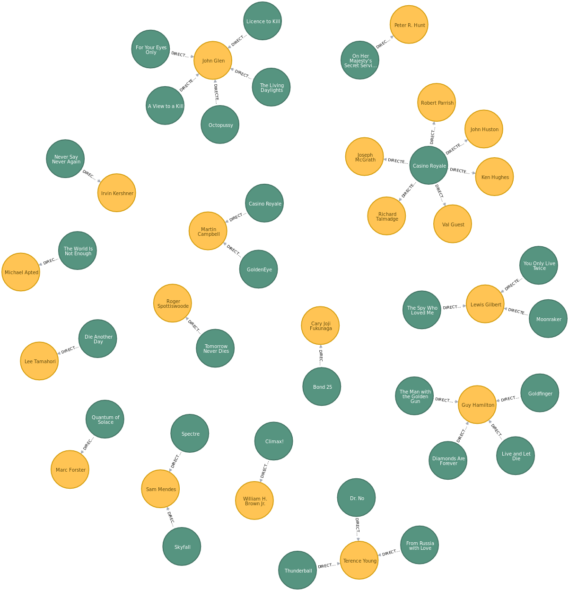

# Hands-on Lab - the `James Bond` dataset 

## Mandatory requirements
- Windows and MacOS users: Open `Docker` settings and ***make sure that you give Docker at least 4GB memory for containers***. Without enough memory you cannot use this hands-on.

## Summary of tasks
1. Preparation by cloning/updating [neo4j-algo-apoc](https://github.com/DIS-SIN/neo4j-algo-apoc) and [neo4j-training-sessions](https://github.com/DIS-SIN/neo4j-training-sessions) repositories, building up the `Docker` images, and creating containers (*preferably to be done ASAP at the beginning of the session* because it takes time),
2. harvesting the data with `requests` and `BeautifulSoup` (and merging it with local data), 
3. executing natural language processing (`NLP`) tasks with the `Stanford NLP` libraries, 
4. combining task 2 & 3, `data modeling` by creating `Neo4j` constraints, indexes, entities and relationships, persisting into a local instance using a wrapper of the `Python Bolt driver`, and 
5. querying the graph using `Cypher`,

## Graph Challenge

---

## Task 1: Preparation

### 1.1 `Docker` and `Docker Compose`
- Have the latest (stable) versions installed
- Test to make sure they work.

### 1.2 `neo4j-algo-apoc` repository

#### 1.2.1a If you have no local `Neo4j` instance:
[Get a local instance of `neo4j`](https://github.com/DIS-SIN/neo4j-algo-apoc)
        
        git clone https://github.com/DIS-SIN/neo4j-algo-apoc.git

Update it if needed:

        cd neo4j-algo-epoc
        git pull

#### 1.2.1b If you have an existing local `Neo4j` instance:
If it is running, stop it (`$NEO4J_ALGO_APOC` is where the `neo4j-algo-epoc` repository is cloned)
        
        cd $NEO4J_ALGO_APOC
        source ./set_env.sh
        docker-compose down

Backup the data directory of the instance (if needed).
Remove the local graph:

        sudo rm -rf data/databases

(Optional) remove the local credentials

        sudo rm -rf data/dbms

#### 1.2.2 Once the local instance is ready:

        source ./set_env.sh
        docker-compose up

Note that for Windows:
- Windows Home edition does not support Docker
- Windows Pro or Enterprise edition does support Docker

Note that for Windows, both options can be enabled easily when running the `docker-compose up` first time. Please pay attention that Windows hide these dialogs in the background.
- [enable Windows to share drives](https://docs.docker.com/docker-for-windows/#shared-drives)
- [allow file sharing between Windows and the containers](https://docs.docker.com/docker-for-windows/https://docs.docker.com/docker-for-windows/#firewall-rules-for-shared-drives)

For Windows, `git bash` is a preferred command line utility, or if you have mastered PowerShell, that can also be an option.

Note that `-d` flag is neeeded if you want the `Neo4j` container runs detached in the background. In this case you can monitor it by using a terminal:

        cd $NEO4J_ALGO_APOC
        tail -f logs/debug.log

### 1.3 `neo4j-training-sessions` repository
Clone [neo4j-training-sessions repository](https://github.com/DIS-SIN/neo4j-training-sessions) *at the same level with `$NEO4J_ALGO_APOC`*:

        git clone https://github.com/DIS-SIN/neo4j-training-sessions

Update it if needed

        git pull

Started the docker containers needed for the session:

        cd session_1
        docker-compose up
	

IMPORTANT NOTE: By default the `imdb_pipeline` is using default `docker network` at `172.17.0.1`. However this is not achieveable in Windows editions. To find out which networking interface is available for the local `Docker`, please try in a Windows terminal:

		ipconfig

Please use the assigned IP address to replace the default IP address of all `172.17.0.1` in `imdb_pipeline.py`.

It is recommended that the docker containers are ran without the `-d` flag for obtaining some error messages on `stdout` in order to fix issues if any.

### 1.5 Monitoring `docker` containers:

        docker stats

### 1.6 Testing if all containers are ready

        cd $NEO4J_TRAINING_SESSIONS
        cd session_1

#### 1.6.1a Starting `Neo4j` local instance for the first time:
If you creates the `Neo4j` image and container for the first time or if you have deleted the local credentials, open a separate terminal, and set the default password for `Neo4j`, which is `##dis@da2019##`. 

        ./set_neo4j_password.sh

Open your favorite browser and direct it to http://localhost:7474. Neo4j will prompt you to enter the password, type the password you just set above. Check if the two custom libraries - ALGO and APOC - are installed by typing into the edit box on the page in the browser:

        RETURN apoc.version();

If it is installed, its version is displayed in the query result.

Similarly with ALGO (Graph Algorithms libary)

        RETURN algo.version();

#### 1.6.1b `Neo4j` local instance already installed and cleaned in step 1.2:
If you already gone through this process, just direct it to http://localhost:7474 to check if it is up and running.

#### 1.6.2 Test if the `IMDB` scrapper `scrapper-0.1:imdb` is up and running:
Direct your browser to http://localhost:8000 to check if it is up and running.

#### 1.6.3 Test if the `Stanford NLP` containers are up and running:
Open a terminal and type the following command to test if the `stanford-nlp-pos` container for running `Part-of-Speech` tagger is ready.

        echo "A passenger plane has crashed shortly after take-off from Kyrgyzstan's capital, Bishkek, killing a large number of those on board. The head of Kyrgyzstan's civil aviation authority said that out of about 90 passengers and crew, only about 20 people have survived. The Itek Air Boeing 737 took off bound for Mashhad, in north-eastern Iran, but turned round some 10 minutes later." | nc localhost 8001

Note: Windows users might not find `nc` (netcat) by default. A port to Windows can be found here: [Netcat for Windows](https://joncraton.org/blog/46/netcat-for-windows/). In that case, if you unzip the downloaded app into ~/Downloads:

		echo "A passenger plane has crashed shortly after take-off from Kyrgyzstan's capital, Bishkek, killing a large number of those on board. The head of Kyrgyzstan's civil aviation authority said that out of about 90 passengers and crew, only about 20 people have survived. The Itek Air Boeing 737 took off bound for Mashhad, in north-eastern Iran, but turned round some 10 minutes later." | ../../Downloads/nc/nc localhost 8001

Open a terminal and type the following command to test if the `stanford-nlp-ner` container for running `Named Entity` tagger is ready.

        echo "A passenger plane has crashed shortly after take-off from Kyrgyzstan's capital, Bishkek, killing a large number of those on board. The head of Kyrgyzstan's civil aviation authority said that out of about 90 passengers and crew, only about 20 people have survived. The Itek Air Boeing 737 took off bound for Mashhad, in north-eastern Iran, but turned round some 10 minutes later." | nc localhost 8002

Note: similarly with Windows `netcat` unzipped into user's `Downloads` directory:

		echo "A passenger plane has crashed shortly after take-off from Kyrgyzstan's capital, Bishkek, killing a large number of those on board. The head of Kyrgyzstan's civil aviation authority said that out of about 90 passengers and crew, only about 20 people have survived. The Itek Air Boeing 737 took off bound for Mashhad, in north-eastern Iran, but turned round some 10 minutes later." | ../../Downloads/nc/nc localhost 8002
		A/O passenger/O plane/O has/O crashed/O shortly/O after/O take-off/O from/O Kyrgyzstan/B-LOC 's/O capital/O ,/O Bishkek/B-LOC ,/O killing/O a/O large/O number/O of/O those/O on/O board/O ./O
		The/O head/O of/O Kyrgyzstan/B-LOC 's/O civil/O aviation/O authority/O said/O that/O out/O of/O about/O 90/O passengers/O and/O crew/O ,/O only/O about/O 20/O people/O have/O survived/O ./O
		The/O Itek/B-ORG Air/O Boeing/B-ORG 737/O took/O off/O bound/O for/O Mashhad/B-PER ,/O in/O north-eastern/O Iran/B-LOC ,/O but/O turned/O round/O some/O 10/O minutes/O later/O ./O
		

#### 1.6.4 Test if the `IMDB` pipeline `imdb_pipeline` is up and running:
Direct your browser to http://localhost:8003 to check if it is up and running.

--- 

## Task 2: Harvesting data

### imdb_scrapper
- `docker` service: `imdb_scrapper` 
- `docker` image: `scrapper-0.1:imdb`
- `docker` container: `session_1_imdb_scrapper_1`

### Description
This task is to illustrate how to gather a dataset from an online source and combined it with another one - previously captured, locally stored. 

A `docker` container is constructed and created. It is a simple web-server, powered by `bottle` web framework and `waitress` WSGI-conformant engine. Once starts, it loads the dataset of [James Bond movie synopses](https://en.wikipedia.org/wiki/List_of_James_Bond_films#Synopses), collected from `Wikipedia`,  stored as [synopsis.tsv](imdb_scrapper/sysnopsis.tsv), then listens on port `8000` and providing the following end-points:
- `localhost:8000/`: reporting running status
- `localhost:8000/scrappe`: using `requests` to access https://www.imdb.com, fetch the movie list at [The James Bond Films](https://www.imdb.com/list/ls006405458/), extract `name`, `url`, `year`, `rating`, `runtime`, `genre`, `votes`, `directors`, and `actors`. It merges the `story` of the movie from IMBD with the `synopsis` data from `Wikipedia`. The content is returned in `json` format.
- `localhost:8000/shutdown`: to remotely shutdown the running service (not the container).

### Try-out
Direct your browser to http://localhost:8000/scrappe, you should be able to obtain the content in `json` format that the end-point provides.

--- 

## Task 3: Executing NLP tasks

### stanford-nlp-pos
- `docker` service: `stanford-nlp-pos` 
- `docker` image: `stanford-nlp-3.9.2:pos`
- `docker` container: `session_1_stanford-nlp-pos_1`

### Description
This is a reusable `docker` that can be used for extracting sequence of Part-of-Speech tags and constructing Key Phrases from given text. Currently:
- it uses `stanford-postagger` library, version `3.9.2` (packaged on `2018-10-16`)
- the language model in use is `english-bidirectional-distsim.tagger` which is slightly slower than the official one, but better quality as recommended by `Stanford NLP` maintainers.
- the docker support `only English`
- `500 MB` memory is used by the Open JDK 8 JVM for running `stanford-postagger.jar`,  `edu.stanford.nlp.tagger.maxent.MaxentTaggerServer` as stand-alone service on port `8001`

### Try-out
Refere to `1.6.3`

### stanford-nlp-ner
- `docker` service: `stanford-nlp-ner` 
- `docker` image: `stanford-nlp-3.9.2:ner`
- `docker` container: `session_1_stanford-nlp-ner_1`

### Description
This is a ***reusable*** `docker` that can be used for extracting sequence of Named Entity tags and constructing Named Entities from given text. Currently:
- it uses `stanford-ner` library, version `3.9.2` (packaged on `2018-10-16`)
- the language model in use is `conll.distsim.iob2.crf.ser.gz` which has better quality as recommended by `Stanford NLP` maintainers.
- the docker support `only English`
- `1000 MB` memory is used by the Open JDK 8 JVM for running `stanford-ner.jar`, `edu.stanford.nlp.ie.NERServer` as stand-alone service on port `8002`

### Try-out
Refere to `1.6.3`

---

## Task 4: The Pipeline

### imdb_pipeline
- `docker` service: `imdb_pipeline` 
- `docker` image: `pipeline-0.1:imdb`
- `docker` container: `session_1_imdb_pipeline_1`

### Description
- partially `data modeling` by creating constraints, indexes for `Neo4j` entities.

        def create_constraints_and_indexes():
            cyphers = [
                'CREATE CONSTRAINT ON (n:Movie) ASSERT n.url IS UNIQUE;',
                'CREATE INDEX ON :Movie(name, year);',
                'CREATE INDEX ON :Movie(rating);',
                'CREATE INDEX ON :Movie(story);',
                'CREATE INDEX ON :Movie(votes);',
                'CREATE CONSTRAINT ON (n:Genre) ASSERT n.text IS UNIQUE;',
                'CREATE CONSTRAINT ON (n:Director) ASSERT n.url IS UNIQUE;',
                'CREATE INDEX ON :Director(name);',
                'CREATE CONSTRAINT ON (n:Actor) ASSERT n.url IS UNIQUE;',
                'CREATE INDEX ON :Actor(name);',
                'CREATE CONSTRAINT ON (n:NamedEntity) ASSERT n.text IS UNIQUE;',
                'CREATE CONSTRAINT ON (n:KeyPhrase) ASSERT n.text IS UNIQUE;',
            ]
            neo4j_adapter.execute_sequential(
                [
                    [work_unit, "WRITE_ACCESS", {'cypher': c}]
                    for c in cyphers
                ], 
                need_result=False
            )

    `neo4j_adapter` is an instance of the ***reusable*** wrapper of Python Bolt driver (python `neo4j-driver` 1.7).
    + handle `thread-safely` multiple requests from multiple threads, 
    + create and manage multiple connections to `Neo4j` instance. 
    + execute a `single` Cypher transaction or a `sequence` of them both `sequentially` or `in parallel`.
    + [multiple] query results can be safely ignored or `selectively` returned.
    + `Bolt` protocol query result as a `combination of nestable` list, dictionary, Node, Relationship, Path, etc are `automatically converted into Python objects`.

- executing to harvest data from IMDB,

- feeding harvested and merged data into POS and NER services of Tasks 3,
    + text content feed to the service up to 4KB
    + supported POS chunk grammar: (<NN> | <JJ>)* (<NN>| <NNS> <VBG>)+
    + supported NER chunk grammar: (<B-[LOC|ORG|PER]>) (<I-[LOC|ORG|PER]>)*

    Extensible:
        - multiple language support by adding new dockers, one per language. Using `docker-swarm` or `Kubernetes` to spawn multiple and scalable dockers.
        - `language detection` is nice to have, if multiple language support is needed. In that case an extra stage for language detection is inserted into the pipeline.
        - other `Natural Language Processing` task can also be added to the pipeline such as `sentiment analysis`, `coreference resolution`, `relation extractor`, or `SPIED`. Note that it is also possible that multiple NLP toolkits can be used in the same pipeline.

- create Cypher to persist entities and relationships - implicitly applied meta modeling 

        # create cypher format and using the python wrapper to persist them into the neo4j instance
        cypher = """
            MERGE (m:Movie {url: "%s"})
                SET m.name = "%s", m.year = '%s', m.rating = "%s", m.runtime = "%s", m.story = "%s", m.votes = "%s"
            WITH m
                FOREACH (e IN [%s] |
                    MERGE (g:Genre {text: e})
                    MERGE (m)-[:IN_GENRE]->(g)
                )
            WITH m
                FOREACH (p IN [%s] |
                    MERGE (d:Director {url: p[0]})
                        SET d.name = p[1]
                    MERGE (m)-[:DIRECTED_BY]->(d)
                )
            WITH m
                FOREACH (p IN [%s] |
                    MERGE (a:Actor {url: p[0]})
                        SET a.name = p[1]
                    MERGE (m)<-[:ACTED_IN]-(a)
                )
            WITH m
                FOREACH (p IN [%s] |
                    MERGE (ne:NamedEntity {text: p[0]})
                        ON CREATE SET ne.f = p[1]
                        ON MATCH SET ne.f = ne.f + p[1]
                    MERGE (m)-[:HAS_NE]->(ne)
                )
            WITH m
                FOREACH (p IN [%s] |
                    MERGE (kp:KeyPhrase {text: p[0]})
                        ON CREATE SET kp.f = p[1]
                        ON MATCH SET kp.f = kp.f + p[1]
                    MERGE (m)-[:HAS_KP]->(kp)
                )
            RETURN 1
        """
       
- persisting into a local `Neo4j` instance using `neo4j-adaper` without explicitly converting data into any Object-Oriented design-based structure:

        cyphers = []
        for movie_info in movie_info_list:
            cyphers.append(
                // create cypher instance by applying concrete data with format defined as above
            )

        neo4j_adapter.execute_sequential(
            [
                [work_unit, "WRITE_ACCESS", {'cypher': c}]
                for c in cyphers
            ], 
            need_result=False
        )
        
    Note: 
    - it is of course possible to use high-performance data pipeline such as Spark/Hadoop
    - it is recommended to use some high-volumn, high-quality streaming service such as Kafka
    - `docker-swarm` or `Kubernetes` to ensure high-availability and scaling
 
### Try-out
- Create constraints and indexes: direct your browser to http://localhost:8003/prepare

- Run the pipeline: direct your browser to http://localhost:8003/process

---

## Task 5: Query the graph
This task is basically to get familiar with `Neo4j Browser`: from how to capture the meta graph of an existing database to more complex queries based on similarities.

- Capturing the meta graph

        CALL apoc.meta.graph();

- Director and movies

        MATCH (m:Movie)-[:DIRECTED_BY]->(d:Director) 
        WITH DISTINCT(d) AS director, COLLECT(DISTINCT(m)) AS movies
        RETURN director, movies

- `The Spy Who Loved Me`

        MATCH (m:Movie {name: "The Spy Who Loved Me"})-[]-(n) RETURN m, n

- `From Russia with Love`

        MATCH (m:Movie {name: "From Russia with Love"})-[]-(n) RETURN m, n

- `Sean Connery` and `Roger Moore`

        MATCH (a1:Actor {name: "Sean Connery"}), (a2:Actor {name: "Roger Moore"}) 
        WITH a1, a2 MATCH p=allShortestPaths((a1)-[:ACTED_IN|DIRECTED_BY*]-(a2))
        RETURN p

- `Actors and movies`

        MATCH (a1:Actor), (a2:Actor) 
        WHERE a1 <> a2
        WITH a1, a2 MATCH p=((a1)-[:ACTED_IN*2]-(a2))
        RETURN p

Most co-occurences:

|co_acting|movies|number_of_movies|
|--------|:-------|----------------:|
|Judi Dench, Daniel Craig|Casino Royale (2006), Quantum of Solace (2008), Skyfall (2012)|3|
|Roger Moore, Maud Adams|The Man with the Golden Gun (1974), Octopussy (1983)|2|
|Roger Moore, Richard Kiel|The Spy Who Loved Me (1977), Moonraker (1979)|2|

 

Top 30 rare Key Phrases

        MATCH (kp:KeyPhrase) RETURN kp.text, kp.f ORDER BY kp.f ASC LIMIT 30

kp.text|kp.f
-------|-----
blowing|1
assassination plot involving|1
circumstances|1
Counter-intelligence|1
lair|1
space launch|1
card wiz|1
American spy|1
colleague|1
actions|1
prisoner|1
atomic-powered radio beam|1
crime boss|1
Revenge|1
case involving|1
fisherman|1
monitoring|1
Strangways|1
nearby islands|1
mineral samples|1
islands|1
disruption|1
American space program|1
resourceful British government agent|1
local shell diver|1
response|1
answers|1
flame-throwing armoured tractor|1
Soviet encryption device|1
naive Russian beauty|1

Top 25 frequent Named Entities

ne.text|ne.f
-------|----
Bond|29
James Bond|21
Blofeld|18
British|16
Goldfinger|12
Le Chiffre|12
Soviet|11
KGB|9
SPECTRE|8
American|8
Sanchez|7
Drax|6
Chinese|6
Elektra|6
Kananga|5
Largo|5
Renard|5
Russian|5
Felix Leiter|5
Lynd|4
Trevelyan|4
Scaramanga|4
Gonzales|4
Stromberg|4
Zorin|4

## Graph Challenge

### The classic problem
*The sides of a circular track contain a sequence of cans of gasoline. The total amount in the cans is sufficient to enable a certain car to make one complete circuit of the track, and it could all fit into the car's gas tank at one time.*

*Is it possible to find an initial location for placing the car so that it will be able to traverse the entire track by using the various amounts of gasoline in the cans that it encounters along the way?*

### The Challenge
*Can you write a Cypher to find out what is the initial location?*
