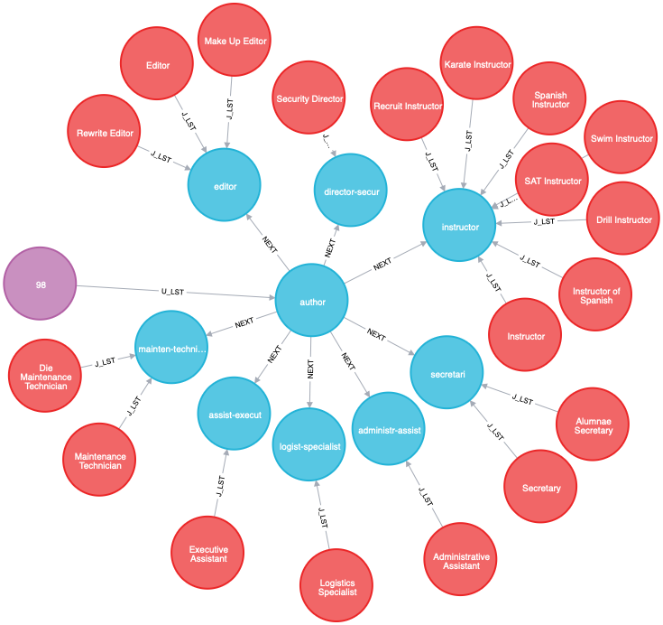
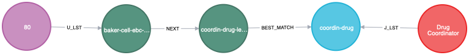
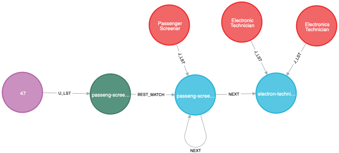
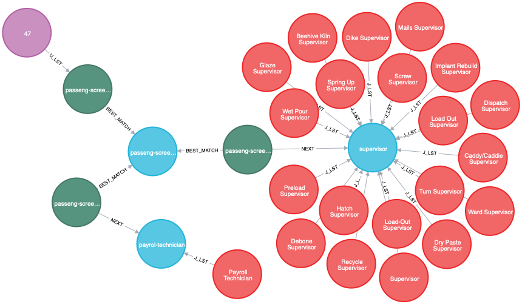
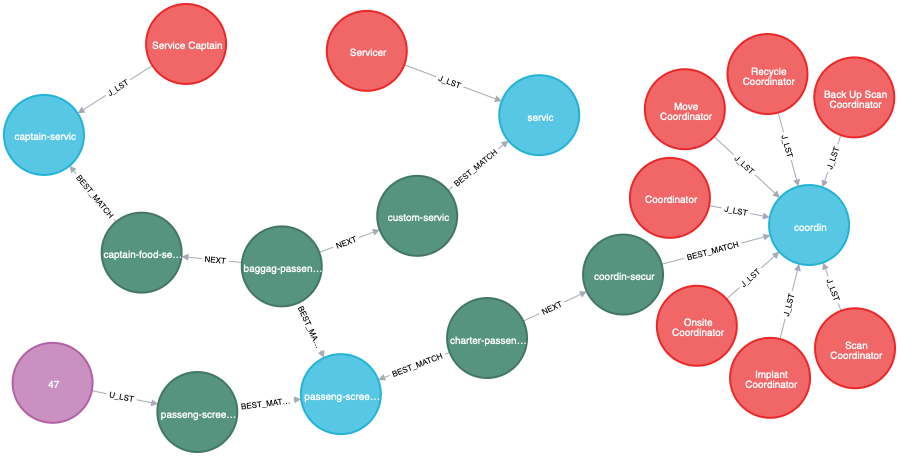
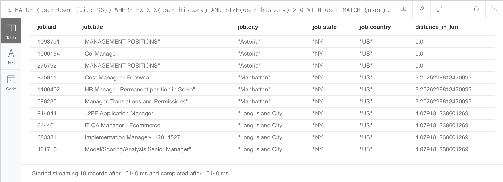
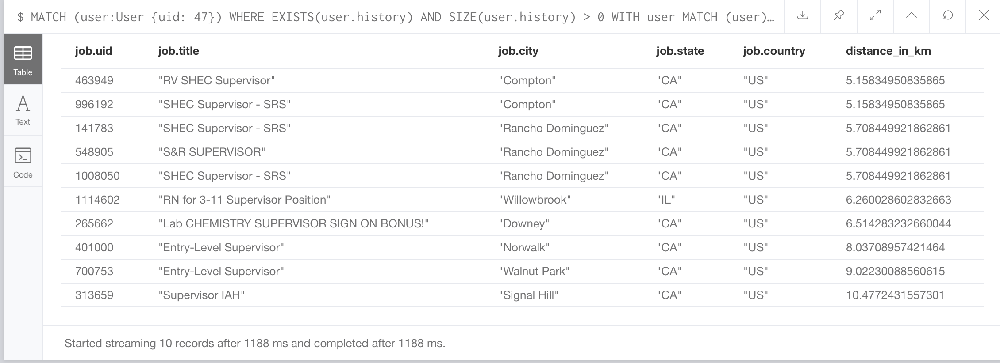

# Hands-on Lab - Recommendation for the ***next*** step in career

## Overview:

### Business case
- Objective: recommending `natural next jobs` from 1M+ job ads.
- Approach:
    + Suggesting jobs based on `collaborative-based filtering` - top most common transitions from a job
    + Using a standard occupation classification system with `tree-like` structure and `clusters` of verified job titles serving as anchor points for matching users' and job ads' job titles. Matching job titles based on `content-based filtering` using Natural Language Processing with ML models for sentence tagging to extract `key phrases` from job title such as `software developer`, `project manager`, ...
    + Improve recommendation quality by using geographical information of user's and job ads' locations

### Technology aspects
- Datasets/APIs/toolkits: 
    + `Kaggle Job Recommendation Challenge` contributed by `CareerBuilder`.
    + Standard Occupaction Classifications (SOC) 2010 from US Bureau of Labour and Statistics (BLS) and O*NET organization for occupations, job titles, tech skills, tools used.
    + Stanford Core Natural Language Processing - `Staford CoreLNP` version `3.9.2` for Part-of-Speech tagging job titles, turning them into `key phrases`.
    + Natural Language Toolkit - `NLTK` version `3.4.3` for lemmatization and stemming of English words.
    + OpenStreetMap - `OSM` server for geocoding location's coordinates.
- Technology framework:
    + Neo4j graph database
    + Docker containers as Micro Services: 
        * Neo4j `CE` version `3.5.5`, exposing via both `HTTP` (7474) and `Bolt` (7687) interfaces
        * Stanford `3.9.2` POS Tagger, exposing via socket (8001)
        * NLTK-wrapped around by Python `bottle` web framework and `waitress` WSGI server
    + Neo4j browser for query executions

## Walkthrough

### 1. Prepare `neo4j-algo-apoc` docker 
- Install/update neo4j-algo-apoc. 
- Remove or cleanup current database. Refer to [Session 1](https://github.com/DIS-SIN/neo4j-training-sessions/tree/master/session_1)
- Make sure that it is running

### 2. Download the `Kaggle`'s `Job Recommendation Challange` dataset

- Sign-up/sign-in to [Kaggle](https://www.kaggle.com)
- Download [Kaggle Job Recommendation Challenge dataset](https://www.kaggle.com/c/3046/download-all)
- Extract the `job-recommendation` directory with its file and place under `import/kaggle/` sub-directory inside `neo4j-algo-apoc` 
- Make sure that the directory is readable by all users/processes.

### 3. Start the `NLP` Dockers
- Go into `session_2` of `neo4j-training-session`

        docker-compose up

- Open a new terminal, go to ``neo4j-training-session\session_2`. 

    + Test Stanford CoreNLP docker:

        wget --post-data 'President Barack Obama attends an United Nations session in New York.' 'localhost:8001/?properties={"annotators":"ner,pos,lemma","outputFormat":"text"}' -O -

        curl --data 'President Barack Obama attends an United Nations session in New York.' 'http://localhost:8001/?properties={%22annotators%22%3A%22tokenize%2Cssplit%2Cpos%22%2C%22outputFormat%22%3A%22json%22}' -o -

    + Test NLTK NLP docker:

        curl -d "@test_data.json" -H"sContent-Type: application/json" -X POST http://localhost:8004/extract

#### 4. Use the `data_tasks.sh`

- Type:

        ./data _tasks.sh

- Following usage help is displayed:

        "Usage: ./data_tasks.sh COMMANDS
        
        To create initial password, cleanup Kaggle data, and import the dataset:
          ./data_tasks.sh COMMANDS

        COMMAND: 
            p: create initial password
            k: cleanup Kaggle data
            i: import the dataset
            b: backup the graph database
            r: restore the graph database
            c: clear the graph database

        EXAMPLES:
            ./data_tasks.sh p: set password only
            ./data_tasks.sh k: clean up Kaggle data only
            ./data_tasks.sh i: import the whole dataset
            ./data_tasks.sh b: backup existing graph database
            ./data_tasks.sh r: restore the graph database from a previous copy
            ./data_tasks.sh pkib: run a p -> k -> i -> b pipeline (1ST TIME)
            ./data_tasks.sh cib: run a c -> i -> b pipeline (CLEAR + IMPORT)
            ./data_tasks.sh rib: run a r -> i -> b pipeline (RESTORE + IMPORT)

        NOTE: order of (optional) execution is p -> k -> c -> r -> i -> b

- A typical use for the first time is:

        ./data_tasks.sh pkib

    What it does:
    + sets password for `neo4j docker` (*optional but needs to run at least once*)
    + cleans up and normalizes `Kaggle dataset` (*optional but needs to run at least once*)
    + imports the whole dataset, extract entities, create relationships, in another word `builds the whole graph`
    + print a `snapshot report` (no separate command for this) of nodes and relationships inside the graph database.
    + create a `backup copy` named `session_2_gdb.tar.gz` in the parent directory of `neo4j-training-sessions`

- In this session:

    + Download a copy of the graph database from [Session 2 Graph Database](https://drive.google.com/drive/folders/1cXRNOPT1XKjTH4SbqkCKbLCPPA1ozXtW?usp=sharing)
    + Save it in the parent directory of `neo4j-training-sessions`
    + Restore the graph database for  `neo4j-algo-apoc` (don't user `p` option if the neo4j password has been set)
        
        ./data_tasks.sh pr

### 5. Test recommmendation queries

Note: turn off `Connect result nodes` on left side panel of the neo4j browser.

- ***User -> Transition to (NEXT) -> Best match Classified title***

        MATCH (user:User {uid: 98})
            WHERE EXISTS(user.history) AND SIZE(user.history) > 0
        WITH user
            MATCH (user)-[r:U_LST {i: SIZE(user.history)-1}]->(u_lst:LSTitle)
        WITH user, r, u_lst
            MATCH (u_lst)-[r1:NEXT]->(j_lst:LSTitle:JT)<-[r2:J_LST]-(jt:JobTitle)
        RETURN user,r,  r1, u_lst, r2, j_lst, jt

- ***User -> Transition to (NEXT) -> Best match Classified title -> ***

- (user)-(next)-(title)-best_match-(job)

        MATCH (user:User {uid: 80})
            WHERE EXISTS(user.history) AND SIZE(user.history) > 0
        WITH user
            MATCH (user)-[r:U_LST {i: SIZE(user.history)-1}]->(u_lst:LSTitle)
        WITH user,r, u_lst
            MATCH (u_lst)-[r1:NEXT]->(nj_lst:LSTitle)-[r2:BEST_MATCH]->(j_lst:LSTitle:JT)<-[r3:J_LST]-(jt:JobTitle)
        RETURN user, r, u_lst, r1, nj_lst, r2, j_lst, r3, jt

- ***User -> Best match Classified title -> Transition to (NEXT) -> Classified title***

        MATCH (user:User {uid: 47})
            WHERE EXISTS(user.history) AND SIZE(user.history) > 0
        WITH user
            MATCH (user)-[:U_LST {i: SIZE(user.history)-1}]->(u_lst:LSTitle)
        WITH user, u_lst
            MATCH (u_lst)-[:BEST_MATCH]->(:LSTitle:JT)-[:NEXT]->(j_lst:LSTitle:JT)<-[:J_LST]-(jt:JobTitle)
        RETURN user, u_lst, j_lst, jt

- ***User -> Best match Classified title -> Best match Real-life title -> Transition to (NEXT) -> Classified title***

        MATCH (user:User {uid: 47})
            WHERE EXISTS(user.history) AND SIZE(user.history) > 0
        WITH user
            MATCH (user)-[r:U_LST {i: SIZE(user.history)-1}]->(u_lst:LSTitle)
        WITH user, r, u_lst
            MATCH (u_lst)-[r1:BEST_MATCH]-(bj1_lst)-[r2:BEST_MATCH]-(bj2_lst:LSTitle)-[r3:NEXT]->(j_lst:LSTitle:JT)<-[r4:J_LST]-(jt:JobTitle)
        RETURN user, r, u_lst, r1, bj1_lst, r2, bj2_lst, r3, j_lst, r4, jt

- ***User -> Best match Classified title -> Best match Real-life title -> Transition to (NEXT) -> Best match Classified title***

        MATCH (user:User {uid: 47})
            WHERE EXISTS(user.history) AND SIZE(user.history) > 0
        WITH user
            MATCH (user)-[r:U_LST {i: SIZE(user.history)-1}]->(u_lst:LSTitle)
        WITH user, r, u_lst
            MATCH (u_lst)-[r1:BEST_MATCH]-(bj1_lst)-[r2:BEST_MATCH]-(bj2_lst:LSTitle)-[r3:NEXT]->(nj_lst:LSTitle)-[r4:BEST_MATCH]->(j_lst:LSTitle:JT)<-[r5:J_LST]-(jt:JobTitle)
        RETURN user, r, u_lst, r1, bj1_lst, r2, bj2_lst, r3, nj_lst, r4, j_lst, r5, jt

- Merge all above queries, aggreating, ranking based on number of paths and adding geocodes

        MATCH (user:User {uid: 98})
            WHERE EXISTS(user.history) AND SIZE(user.history) > 0
        WITH user
            MATCH (user)-[:IN_CITY]->(city:City)
        WITH user, city
            MATCH (user)-[r:U_LST {i: SIZE(user.history)-1}]->(u_lst:LSTitle)
        WITH user, city, u_lst    
            OPTIONAL MATCH (u_lst)-[r:NEXT]->(:LSTitle:JT)<-[:J_LST]-(jt:JobTitle)
        WITH DISTINCT(jt) AS jt, user, city, u_lst, SUM(SIZE(r.users)) AS jc
        WITH user, city, u_lst, apoc.map.fromPairs(COLLECT([jt.code, jc])) AS jc_map
        WITH user, city, u_lst, jc_map
            OPTIONAL MATCH (u_lst)-[r:NEXT]->(:LSTitle)-[:BEST_MATCH]->(:LSTitle:JT)<-[:J_LST]-(jt:JobTitle)
        WITH DISTINCT(jt) AS jt, user, city, u_lst, jc_map, SUM(SIZE(r.users)) AS jc
        WITH user, city, u_lst, jc_map, COLLECT([jt.code, jc]) AS jt_list
        WITH user, city, u_lst, REDUCE(m=jc_map, e IN jt_list | CASE WHEN apoc.map.get(m, e[0], -1) = -1 THEN apoc.map.setKey(m, e[0], e[1]) ELSE apoc.map.setKey(m, e[0], apoc.map.get(m, e[0], -1) + e[1])   END) AS jc_map
        WITH user, city, u_lst, jc_map
            OPTIONAL MATCH (u_lst)-[:BEST_MATCH]->(:LSTitle:JT)-[r:NEXT]->(:LSTitle:JT)<-[:J_LST]-(jt:JobTitle)
        WITH DISTINCT(jt) AS jt, user, city, u_lst, jc_map, SUM(SIZE(r.users)) AS jc
        WITH user, city, u_lst, jc_map, COLLECT([jt.code, jc]) AS jt_list
        WITH user, city, u_lst, REDUCE(m=jc_map, e IN jt_list | CASE WHEN apoc.map.get(m, e[0], -1) = -1 THEN apoc.map.setKey(m, e[0], e[1]) ELSE apoc.map.setKey(m, e[0], apoc.map.get(m, e[0], -1) + e[1])   END) AS jc_map
        WITH user, city, u_lst, jc_map
            OPTIONAL MATCH (u_lst)-[:BEST_MATCH]-(:LSTitle)-[:BEST_MATCH]-(:LSTitle)-[r:NEXT]->(:LSTitle:JT)<-[:J_LST]-(jt:JobTitle)
        WITH DISTINCT(jt) AS jt, user, city, u_lst, jc_map, SUM(SIZE(r.users)) AS jc
        WITH user, city, u_lst, jc_map, COLLECT([jt.code, jc]) AS jt_list
        WITH user, city, u_lst, REDUCE(m=jc_map, e IN jt_list | CASE WHEN apoc.map.get(m, e[0], -1) = -1 THEN apoc.map.setKey(m, e[0], e[1]) ELSE apoc.map.setKey(m, e[0], apoc.map.get(m, e[0], -1) + e[1])   END) AS jc_map
        WITH user, city, u_lst, jc_map
            OPTIONAL MATCH (u_lst)-[:BEST_MATCH]-(:LSTitle)-[:BEST_MATCH]-(:LSTitle)-[r:NEXT]->(:LSTitle)-[:BEST_MATCH]->(:LSTitle:JT)<-[:J_LST]-(jt:JobTitle)
        WITH DISTINCT(jt) AS jt, user, city, u_lst, jc_map, SUM(SIZE(r.users)) AS jc
        WITH user, city, u_lst, jc_map, COLLECT([jt.code, jc]) AS jt_list
        WITH user, city, u_lst, REDUCE(m=jc_map, e IN jt_list | CASE WHEN apoc.map.get(m, e[0], -1) = -1 THEN apoc.map.setKey(m, e[0], e[1]) ELSE apoc.map.setKey(m, e[0], apoc.map.get(m, e[0], -1) + e[1])   END) AS jc_map
        WITH user, city, u_lst, jc_map
        WITH user, city, u_lst, apoc.map.sortedProperties(jc_map) AS jt_list
        WITH user, city, u_lst, jt_list
            UNWIND jt_list AS jc
        WITH user, city, u_lst, jc[0] AS jt_code, jc[1] AS c ORDER BY c DESC LIMIT 10
        WITH user, city, u_lst, jt_code, c AS rank
            MATCH (jt:JobTitle {code: jt_code})-[:J_LST]->(j_lst:LSTitle)<-[:A_LST|BEST_MATCH*1..2]-(job:Job)-[:IN_CITY]->(job_location:City)
                WHERE EXISTS(job_location.latitude)
        WITH DISTINCT(job) AS job, user, city, u_lst, SUM(rank) AS rank, job_location, DISTANCE(POINT(city), POINT(job_location))/1000 AS distance_in_km
        WITH rank, job, distance_in_km
            WHERE distance_in_km < 20.0
        RETURN rank, job.uid, job.title, job.city, job.state, job.country, distance_in_km ORDER BY distance_in_km LIMIT 10

        MATCH (user:User {uid: 47})
            WHERE EXISTS(user.history) AND SIZE(user.history) > 0
        WITH user
            MATCH (user)-[:IN_CITY]->(city:City)
        WITH user, city
            MATCH (user)-[r:U_LST {i: SIZE(user.history)-1}]->(u_lst:LSTitle)
        WITH user, city, u_lst    
            OPTIONAL MATCH (u_lst)-[r:NEXT]->(:LSTitle:JT)<-[:J_LST]-(jt:JobTitle)
        WITH DISTINCT(jt) AS jt, user, city, u_lst, SUM(SIZE(r.users)) AS jc
        WITH user, city, u_lst, apoc.map.fromPairs(COLLECT([jt.code, jc])) AS jc_map
        WITH user, city, u_lst, jc_map
            OPTIONAL MATCH (u_lst)-[r:NEXT]->(:LSTitle)-[:BEST_MATCH]->(:LSTitle:JT)<-[:J_LST]-(jt:JobTitle)
        WITH DISTINCT(jt) AS jt, user, city, u_lst, jc_map, SUM(SIZE(r.users)) AS jc
        WITH user, city, u_lst, jc_map, COLLECT([jt.code, jc]) AS jt_list
        WITH user, city, u_lst, REDUCE(m=jc_map, e IN jt_list | CASE WHEN apoc.map.get(m, e[0], -1) = -1 THEN apoc.map.setKey(m, e[0], e[1]) ELSE apoc.map.setKey(m, e[0], apoc.map.get(m, e[0], -1) + e[1])   END) AS jc_map
        WITH user, city, u_lst, jc_map
            OPTIONAL MATCH (u_lst)-[:BEST_MATCH]->(:LSTitle:JT)-[r:NEXT]->(:LSTitle:JT)<-[:J_LST]-(jt:JobTitle)
        WITH DISTINCT(jt) AS jt, user, city, u_lst, jc_map, SUM(SIZE(r.users)) AS jc
        WITH user, city, u_lst, jc_map, COLLECT([jt.code, jc]) AS jt_list
        WITH user, city, u_lst, REDUCE(m=jc_map, e IN jt_list | CASE WHEN apoc.map.get(m, e[0], -1) = -1 THEN apoc.map.setKey(m, e[0], e[1]) ELSE apoc.map.setKey(m, e[0], apoc.map.get(m, e[0], -1) + e[1])   END) AS jc_map
        WITH user, city, u_lst, jc_map
            OPTIONAL MATCH (u_lst)-[:BEST_MATCH]-(:LSTitle)-[:BEST_MATCH]-(:LSTitle)-[r:NEXT]->(:LSTitle:JT)<-[:J_LST]-(jt:JobTitle)
        WITH DISTINCT(jt) AS jt, user, city, u_lst, jc_map, SUM(SIZE(r.users)) AS jc
        WITH user, city, u_lst, jc_map, COLLECT([jt.code, jc]) AS jt_list
        WITH user, city, u_lst, REDUCE(m=jc_map, e IN jt_list | CASE WHEN apoc.map.get(m, e[0], -1) = -1 THEN apoc.map.setKey(m, e[0], e[1]) ELSE apoc.map.setKey(m, e[0], apoc.map.get(m, e[0], -1) + e[1])   END) AS jc_map
        WITH user, city, u_lst, jc_map
            OPTIONAL MATCH (u_lst)-[:BEST_MATCH]-(:LSTitle)-[:BEST_MATCH]-(:LSTitle)-[r:NEXT]->(:LSTitle)-[:BEST_MATCH]->(:LSTitle:JT)<-[:J_LST]-(jt:JobTitle)
        WITH DISTINCT(jt) AS jt, user, city, u_lst, jc_map, SUM(SIZE(r.users)) AS jc
        WITH user, city, u_lst, jc_map, COLLECT([jt.code, jc]) AS jt_list
        WITH user, city, u_lst, REDUCE(m=jc_map, e IN jt_list | CASE WHEN apoc.map.get(m, e[0], -1) = -1 THEN apoc.map.setKey(m, e[0], e[1]) ELSE apoc.map.setKey(m, e[0], apoc.map.get(m, e[0], -1) + e[1])   END) AS jc_map
        WITH user, city, u_lst, jc_map
        WITH user, city, u_lst, apoc.map.sortedProperties(jc_map) AS jt_list
        WITH user, city, u_lst, jt_list
            UNWIND jt_list AS jc
        WITH user, city, u_lst, jc[0] AS jt_code, jc[1] AS c ORDER BY c DESC LIMIT 10
        WITH user, city, u_lst, jt_code, c AS rank
            MATCH (jt:JobTitle {code: jt_code})-[:J_LST]->(j_lst:LSTitle)<-[:A_LST|BEST_MATCH*1..2]-(job:Job)-[:IN_CITY]->(job_location:City)
                WHERE EXISTS(job_location.latitude)
        WITH DISTINCT(job) AS job, user, city, u_lst, SUM(rank) AS rank, job_location, DISTANCE(POINT(city), POINT(job_location))/1000 AS distance_in_km
        WITH rank, job, distance_in_km
            WHERE distance_in_km < 20.0
        RETURN rank, job.uid, job.title, job.city, job.state, job.country, distance_in_km ORDER BY distance_in_km LIMIT 10

