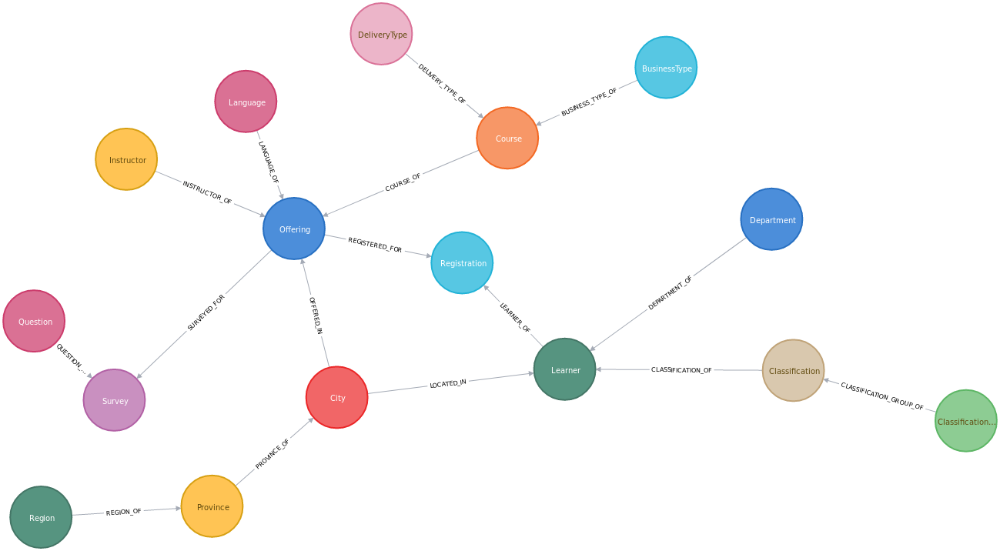

# course_survey_analytics

## A simple analytics on response rate of course survey

What is this: This project is to serve as a base for simple analytics of response rate of course survey of the school.

## How to use this repository?

1. Clone the `neo4j-algo-apoc` from https://github.com/DIS-SIN/neo4j-algo-apoc. Follow instructions in README.md and use `docker-compose` to create a local running docker container of a fresh neo4j instance.

        git clone https://github.com/DIS-SIN/neo4j-algo-apoc.git
        source ./set_env.sh
        docker-compose up

Note: it might worth to increase the required memory for neo4j in the docker-compose.yml as following
- NEO4J_dbms_memory_heap_initial__size=4G
- NEO4J_dbms_memory_heap_max__size=4G
- NEO4J_dbms_memory_pagecache_size=2G

2. Clone this `neo4j-training-sessions` repository. It would be best if at the same directory level as `neo4j-algo-apoc`

        cd ..
        git clone https://github.com/DIS-SIN/neo4j-training-sessions.git

3. Ask one of the gurus in the DIS team (probably Sam Louden) to give you a dataset of survey data, which should include:
- All data of course, offering, registration, learner, and billing department: `registration.tsv`.
- Online and Classroom survey results: `survey_data.tsv`.
- Note that these files should be in tab-separated format.

4. Copy these 2 files into the `import/csps` sub-directory of `neo4j-algo-apoc` instance.

        cp WHERE_THE_TSV_FILES_ARE/*.tsv ../neo4j-algo-apoc/import/csps/.

5. Make sure you have `python3` in the path. Activate `python` virtual environment if needed. Run `data_tasks.sh` to see what are the options:

        ./data_tasks.sh
        Usage: ./data_tasks.sh <neo4j-algo-apoc directory> <COMMANDS>
          COMMAND:
              p: set initial password for neo4j
              n: normalize registration & survey data
              e: extract entities and relationships
              i: import data
              b: backup the graph database
          EXAMPLES:
              ./data_tasks.sh n: set initial password for neo4j only
              ./data_tasks.sh n: normalize registration & survey data only
              ./data_tasks.sh e: extract entities and relationships only
              ./data_tasks.sh i: import data only
              ./data_tasks.sh b: backup the graph database only
              ./data_tasks.sh nepib: run a n -> e -> p -> i -> b pipeline (1ST TIME)
              ./data_tasks.sh ib: run a i -> b pipeline (fresh IMPORT)
         NOTE: order of (optional) execution is n -> e -> i -> b

Normally, for the first time you would use:

        data_tasks.sh ../neo4j-algo-apoc neipb

Note 1: type your password when neeed to grant access for neo4j directories management.

Note 2: the total amount of time it might take is about 8-10 minutes.

Important note: if you are using Mac OS X, install `gnu-sed`, and check if it is installed.

        brew install gnu-sed
        gsed

6. Obtaining the data schema:
- Unlike other databases,neo4j data models (schema) can be obtained AFTER importing all the data. Since entities in neo4j are loosely defined with non-mandatory, combinable labels and properties, so it would be difficult and useless to strictly enforce everything at the beginning. Use your browser and open `http://localhost:7474`. Type:

        CALL apoc.meta.graph()

Probably the following graph will be displayed in the neo4j browser. Feel free to place with it.

7. Checkout the statistics at `neo4j-algo-apoc`/import/csps/reports

        CALL apoc.export.csv.query(
        	"MATCH (c:Course)<-[:BUSINESS_TYPE_OF]-(business_type:BusinessType)
        		WHERE business_type.name IN ['Instructor-Led', 'Events']
        	WITH c
        		MATCH (c)-[:COURSE_OF]->(o:Offering)-[:SURVEYED_FOR]->(s:Survey)
        	WITH
        		DISTINCT(c) AS c,
        		COLLECT(DISTINCT(o.uid)) AS offering_uid_list,
        		COUNT(DISTINCT(s)) AS survey_count
        	WITH
        		c,
        		offering_uid_list,
        		survey_count
        		MATCH (c)-[:COURSE_OF]->(o:Offering)-[:REGISTERED_FOR]->(r:Registration {status: 'Confirmed'})
        			WHERE o.uid IN offering_uid_list
        	WITH
        		DISTINCT(c.code) AS course_code,
        		c.title AS course_title,
        		SIZE(offering_uid_list) AS number_of_offerings,
        		survey_count,
        		COUNT(DISTINCT(r)) AS confirmed_registration_count
        	RETURN
        		course_code,
        		course_title,
        		number_of_offerings,
        		confirmed_registration_count,
        		survey_count,
        		ROUND(10000.0*survey_count/(1.0*confirmed_registration_count))/100.0 AS response_rate
        			ORDER BY response_rate DESC;",
        	'/csps/reports/classroom_survey.csv',
        	{}
        );

        CALL apoc.export.csv.query(
        	"MATCH (c:Course)<-[:BUSINESS_TYPE_OF]-(business_type:BusinessType)
        		WHERE business_type.name IN ['Online']
        	WITH c
        		MATCH (c)-[:COURSE_OF]->(:Offering)-[:SURVEYED_FOR]->(s:Survey)
        	WITH
        		DISTINCT(c) AS c,
        		MIN(s.date) AS earliest_start_date,
        		COUNT(DISTINCT(s)) AS survey_count
        	WITH
        		c,
        		earliest_start_date,
        		survey_count
        		MATCH (c)-[:COURSE_OF]->(:Offering)-[:REGISTERED_FOR]->(r:Registration {status: 'Confirmed'})
        			WHERE earliest_start_date >= r.date - DURATION('P7D')
        	WITH
        		DISTINCT(c.code) AS course_code,
        		c.title AS course_title,
        		survey_count,
        		COUNT(DISTINCT(r)) AS confirmed_registration_count
        	RETURN
        		course_code,
        		course_title,
        		confirmed_registration_count,
        		survey_count,
        		ROUND(10000.0*survey_count/(1.0*confirmed_registration_count))/100.0 AS response_rate
        			ORDER BY response_rate DESC;",
        	'/csps/reports/online_survey.csv',
        	{}
        );

        CALL apoc.export.csv.query(
        	"MATCH (c:Course)<-[:BUSINESS_TYPE_OF]-(business_type:BusinessType)
        		WHERE business_type.name IN ['Instructor-Led', 'Events']
        	WITH c
        		MATCH (c)-[:COURSE_OF]->(o:Offering)
        	WITH c, o
        		MATCH (o)-[:SURVEYED_FOR]->(s:Survey)
        	WITH c, o, COUNT(DISTINCT(s)) AS number_of_surveys
        	WITH c, o, number_of_surveys
        		MATCH (o)-[:REGISTERED_FOR]->(r:Registration {status: 'Confirmed'})
        	WITH c, o, number_of_surveys, COUNT(DISTINCT(r)) AS number_of_confirmed_registrations
        	RETURN
        		c.code AS course_code,
        		c.title AS course_title,
        		o.uid AS offering,
        		number_of_confirmed_registrations,
            number_of_surveys,
        		ROUND(10000.0*number_of_surveys/(1.0*number_of_confirmed_registrations))/100.0 AS response_rate
        			ORDER BY course_code, offering, response_rate DESC;",
        	'/csps/reports/detailed_response_rates.csv',
        	{}
        );

8. Cleaning the neo4j instance:
		docker-compose down
        sudo rm -rf ../neo4j-algo-apoc/data/databases
        sudo rm -rf ../neo4j-algo-apoc/data/dbms

Note: you can also remove the survey data from the `import` directory:

        sudo rm -rf ../neo4j-algo-apoc/import/*.tsv
