# Neo4j streaming with Kafka

## A powerful framework for modern data streaming

[Apache Kafka](https://kafka.apache.org) provided by [Confluent Platform](https://www.confluent.io/product/confluent-platform/), together with [Neo4j](https://neo4j.com) as foundation for data streaming architecture.

## How to use this repository?

### Setting up the environment:

1. Setup environment variables:

        source ./set_env.sh

2. Get `Kafka Connect Neo4j Sink` from `Confluent`:

        ./get_kafka_plugin.sh

    The script downloads `neo4j-kafka-connect-neo4j-1.0.3.zip` from [neo4j-streams-3.5.3](https://github.com/neo4j-contrib/neo4j-streams/releases/download/3.5.3/) and expands it in `plugins` sub-directory.

    For more information: [Kafka Connect Neo4j Sink](https://www.confluent.io/connector/kafka-connect-neo4j-sink/)

3. (Optional) Get a compressed copy of [registration/survey Neo4j database](https://drive.google.com/open?id=1r4mc6piO86ELTtRFZP-c8a5qpac4LTU3) to, for example, local `Downloads` directory.

        mkdir dwh/data
        mv ~/Download/csps_survey_gdb.tar.gz dwh/data/.
        cd dwh/data/
        tar xzvf csps_survey_gdb.tar.gz
        sudo chmod -R 777 databases

        (you might need to type your password here)

        rm csps_survey_gdb.tar.gz
        cd ../..

        (you should be in neo4j-training-sessions/session_4)

4. Build the dockers. Note that to build and run the whole set of dockers described in `docker-compose.yml`, you should have at least 8GB free memory. If you don't, find instructions below how you can build partial set of them and still test most of the scenarios.

        docker-compose up

  Note 1: *to create a fresh build with latest images (wherever possible)*

        docker-compose up --build

  Note 2: on slow network, slow machine, the whole build and startup process might takes 10-15 minutes.

  Note 3: during the build, when encounter errors, if you want to remove all containers, images, cleanup the system, use the following. Note that it would erase all containers and images, thus the build takes more time, so use it with caution.

        docker container rm -f $(docker container ls -aq)
        docker image rm -f $(docker image ls -aq)
        docker system prune

  Dockers' status

        docker stats

  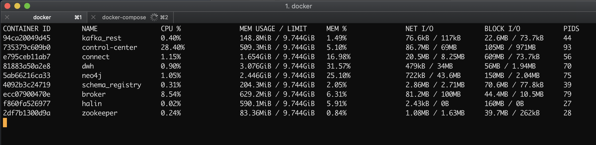

5. Rename `contrib.sink.avro.neo4j.json.template`

        cp contrib.sink.avro.neo4j.json.template contrib.sink.avro.neo4j.json

6. Configure the `Neo4jSinkConnector` with `connect`:

        curl -X POST http://localhost:8083/connectors \
          -H 'Content-Type:application/json' \
          -H 'Accept:application/json' \
          -d @contrib.sink.avro.neo4j.json

        {  
          "name":"Neo4jSinkConnector",
          "config":{  
              "topics":"my-topic",
              "connector.class":"streams.kafka.connect.sink.Neo4jSinkConnector",
              "errors.retry.timeout":"-1",
              "errors.retry.delay.max.ms":"1000",
              "errors.tolerance":"all",
              "errors.log.enable":"true",
              "errors.log.include.messages":"true",
              "neo4j.server.uri":"bolt://neo4j:7687",
              "neo4j.authentication.basic.username":"neo4j",
              "neo4j.authentication.basic.password":"##dis@da2019##",
              "neo4j.encryption.enabled":"false",
              "neo4j.topic.cypher.my-topic":"MERGE (p:Person{name: event.name, surname: event.surname}) MERGE (f:Family{name: event.surname}) MERGE (p)-[:BELONGS_TO]->(f)",
              "name":"Neo4jSinkConnectorAVRO"
          },
          "tasks":[  
            {  
              "connector":"Neo4jSinkConnectorAVRO",
              "task":0
            }
          ],
          "type":"sink"
        }

7. Perform basic testing:

  - Download [neo4j-streams-sink-tester-1.0](https://github.com/conker84/neo4j-streams-sink-tester/releases/download/1/neo4j-streams-sink-tester-1.0.jar)

  - Use browser and login with password `##dis@da2019##` to `neo4j` at http://localhost:7474/browser/.

  - Create constraint and index to make persistence operation faster:

          CREATE INDEX ON :Person(surname);
          CREATE CONSTRAINT ON (f:Family) ASSERT f.name IS UNIQUE;

  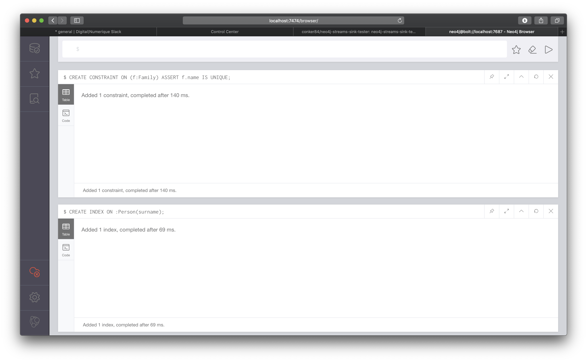

  - Run test:

          java -jar neo4j-streams-sink-tester-1.0.jar -t my-topic -f AVRO -e 50

          log4j:WARN No appenders could be found for logger (org.apache.kafka.clients.producer.ProducerConfig).
          log4j:WARN Please initialize the log4j system properly.
          log4j:WARN See http://logging.apache.org/log4j/1.2/faq.html#noconfig for more info.
          You are sending data in AVRO format

- Verify test results:

          MATCH (f:Family)-[]-(p:Person) RETURN f, p;

  

### 2. Python clients

1. Install `confluent_kafka` and Apache `avro` python packages.

        pip3 install confluent_kafka
        pip3 install avro-python3

    Note: [Apache Avro™](https://avro.apache.org) Apache Avro is a data serialization system. It provides:
    - Rich data structures.
    - A compact, fast, binary data format.
    - A container file, to store persistent data.
    - Remote procedure call (RPC).
    - Simple integration with dynamic languages. Code generation is not required to read or write data files nor to use or implement RPC protocols. Code generation as an optional optimization, only worth implementing for statically typed languages.

2. In a terminal, run command-line `test_python_consumer.sh` for consumer.

        ./test_python_consumer.sh my-topic

      This will wait for new messages.

3. In another terminal, run command-line `test_python_producer.sh` for producer:

        ./test_python_producer.sh my-topic Sinan Baltacioglu

        (3.7.3) nghias-mbp:session_4 nghia$ ./test_python_producer.sh my-topic Sinan Baltacioglu
        (3.7.3) nghias-mbp:session_4 nghia$ ./test_python_producer.sh my-topic Meghan Baltacioglu

      The terminal where `test_kafka_consumer.sh` should display below content:

        (3.7.3) nghias-mbp:session_4 nghia$ ./test_python_producer.sh my-topic
        Press Ctrl+C when you want to stop the consumer.
        {'name': 'Sinan', 'surname': 'Baltacioglu'}
        {'name': 'Meghan', 'surname': 'Baltacioglu'}
        ^CTerminating ...

      Use Neo4j browser to show newly added entities and relationships:

      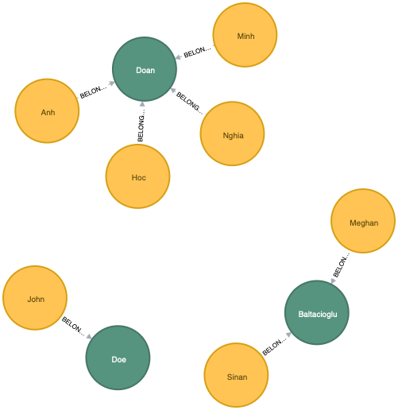  

### 2. Kafka standard command-line clients with AVRO formated messages

1. In a terminal, run command-line `test_kafka_consumer.sh` for consumer.

        ./test_kafka_consumer.sh my-topic

      This will wait for new messages.

2. In another terminal, run command-line `test_kafka_producer.sh` for producer:

        ./test_kafka_producer.sh my-topic

      (it waits for input, so type the following)

          {"name": "X", "surname": "Men"}

      Use Neo4j browser to show newly added entities and relationships:

      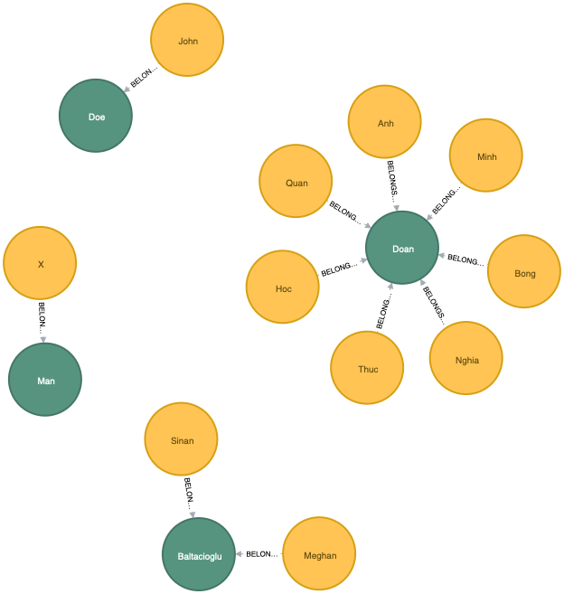  

### 4. REST Proxy clients

Kafka officially offers a number of [clients](https://docs.confluent.io/current/clients/index.html). There are several ways to connect Javascript clients to Kafka:

- Using the official [REST Proxy](https://docs.confluent.io/current/kafka-rest/index.html): The Confluent REST Proxy provides a RESTful interface to a Kafka cluster, making it easy to produce and consume messages, view the state of the cluster, and perform administrative actions without gvusing the native Kafka protocol or clients. It has limitations. However it is probably the best way to connect a vast number of JS-based clients to Kafka clusters.

- Using one of various existings Node.js libraries: basically most of them are built on top of `librdkafka`, which is a C/C++ library, fast, but requires recompilation/linking on the target platform. This is not recommended if you don't know how to deal with it. The other way is to use `kafka-node`, which is a pure Node.js implementation, unfortunately it does not support `Avro`.

- Create an intermediate server application, that can connect other clients to Kafka. This would be a good solution, but it loses `Kafka-flavor`, meaning additional protocol and communication stacks have to be created.

That's why solution based on the first alternative is advised.

1. Consume messages via REST Proxy:

  Create an endpoint:

        curl -X POST  -H "Content-Type: application/vnd.kafka.v2+json" \
        --data '{"name": "my_consumer_instance", "format": "avro", "auto.offset.reset": "earliest"}' \
        http://localhost:8082/consumers/my_avro_consumer

  Subscribe:

        curl -X POST -H "Content-Type: application/vnd.kafka.v2+json" \
        --data '{"topics":["my-topic"]}' \
        http://localhost:8082/consumers/my_avro_consumer/instances/my_consumer_instance/subscription

  Consume messages:

        curl -X GET -H "Accept: application/vnd.kafka.avro.v2+json" \
        http://localhost:8082/consumers/my_avro_consumer/instances/my_consumer_instance/records

        [{"topic":"my-topic","key":null,"value":{"name":"Bong","surname":"Doan"},"partition":0,"offset":0},{"topic":"my-topic","key":null,"value":{"name":"Bong","surname":"Doan"},"partition":0,"offset":1},{"topic":"my-topic","key":null,"value":{"name":"Thuc","surname":"Doan"},"partition":0,"offset":2},{"topic":"my-topic","key":null,"value":{"name":"Quan","surname":"Doan"},"partition":0,"offset":3},{"topic":"my-topic","key":null,"value":{"name":"X","surname":"Man"},"partition":0,"offset":4}]
All steps below can be executed by:

        ./test_rest_consumer.sh

2. Producer message via REST Proxy:

        curl -X POST -H "Content-Type: application/vnd.kafka.avro.v2+json" \
        -H "Accept: application/vnd.kafka.v2+json" \
        --data '{"value_schema": "{\"type\": \"record\", \"name\": \"User\", \"fields\": [{\"name\": \"name\", \"type\": \"string\"}, {\"name\": \"surname\", \"type\": \"string\"}]}", "records": [{"value": {"name": "Viet", "surname": "Doan"}}]}' \
        http://localhost:8082/topics/my-topic

        {"offsets":[{"partition":0,"offset":5,"error_code":null,"error":null}],"key_schema_id":null,"value_schema_id":2}

### 5. Produce and consume data streams *instantly & directly* via Cypher with Streams Procedures

1. Login into `dwh` neo4j instance: http://localhost:7575, note that it uses Bolt service at `localhost:7676`, and type:

        CALL streams.publish(
          'neo4j-topic',
          apoc.convert.toJson(apoc.map.fromPairs([["name", "Black"], ["surname", "Smith"]]))
        )

2. Login into `dwh` neo4j instance: http://localhost:7474, note that it uses Bolt service at `localhost:7687`, and type:

        CALL streams.consume('neo4j-topic')
          YIELD event
        WITH apoc.convert.fromJsonMap(event.data.payload) AS map
          MERGE (p:Person {name: map['name'], surname: map['surname']})
            MERGE (f:Family{name: map['surname']})
            MERGE (p)-[:BELONGS_TO]->(f)

      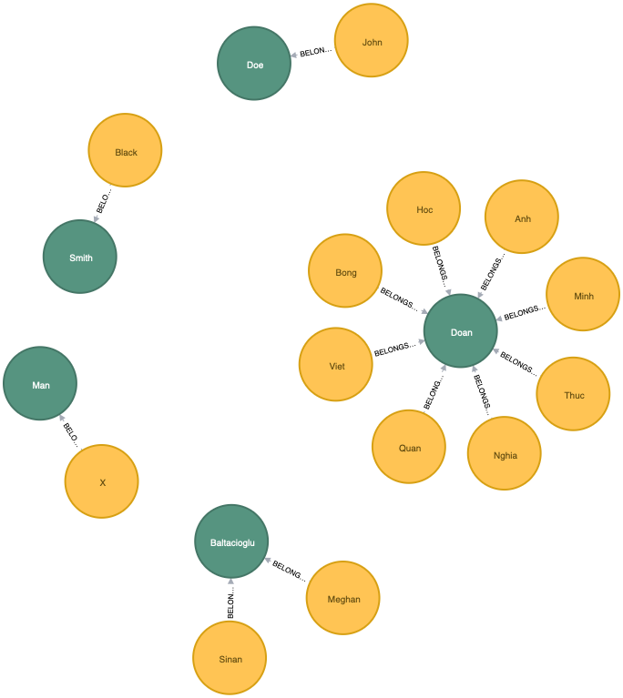

3. Any Kafka client that subscribes to `neo4-topic` should receives these messages as well.

4. Now let's stream some data. On `dwh`, select a few courses with registrations and survey responses, and stream them to `neo4j`:

        MATCH (c:Course)<-[:BUSINESS_TYPE_OF]-(business_type:BusinessType)
          WHERE business_type.name IN ['Instructor-Led', 'Events']
        WITH c
          MATCH (c)-[:COURSE_OF]->(o:Offering)-[:SURVEYED_FOR]->(s:Survey)
          WHERE o.start_date >= DATE('2019-04-03') AND o.start_date <= DATE('2019-04-05')
        WITH DISTINCT(o) AS o, c, COLLECT(DISTINCT(s.uid)) AS survey_list
        WITH c, o, survey_list
          MATCH (o)-[:REGISTERED_FOR]->(r:Registration {status: 'Confirmed'})
        WITH DISTINCT(o.uid) AS o, c, survey_list, COLLECT(DISTINCT(r.uid)) AS registration_list
        WITH DISTINCT(c.title) AS c, COLLECT([o, survey_list, registration_list]) AS osr
        WITH COLLECT([c, osr]) AS courses
          CALL streams.publish('neo4j-topic', apoc.convert.toJson(courses))
        RETURN 1

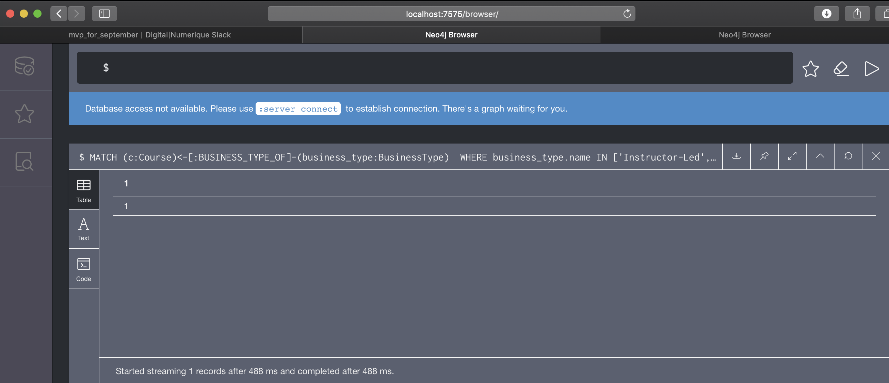

5. It arrives to `neo4j` when `stream.consume()` is invoked.

        CALL streams.consume('neo4j-topic') YIELD event RETURN event

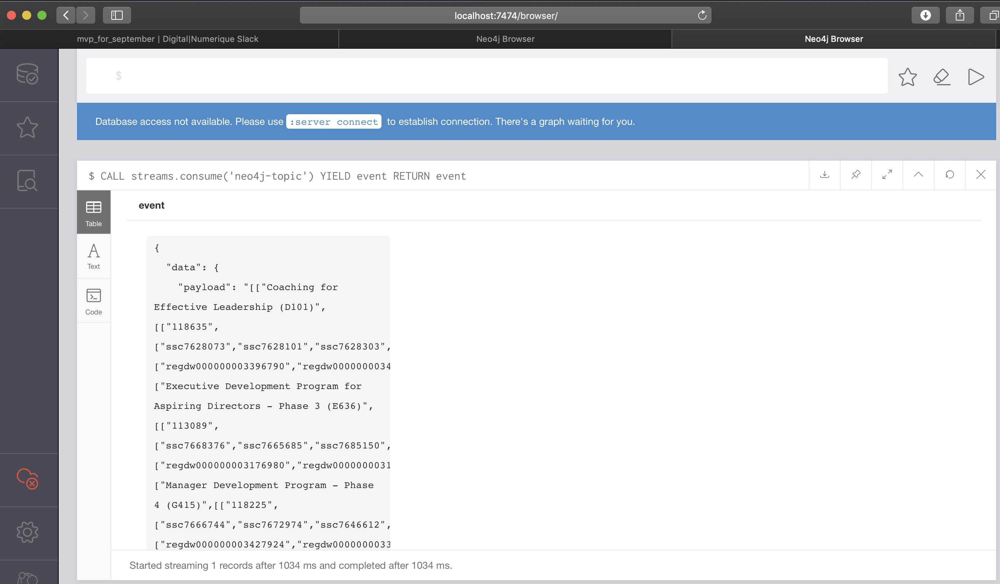

### 6. Monitoring Neo4j with halin

1. Open browser windows, navigate to `localhost:3000`, choose `7676` as Bolt port, type the neo4j password and access to `Halin` monitoring interface of `dwh` instance.

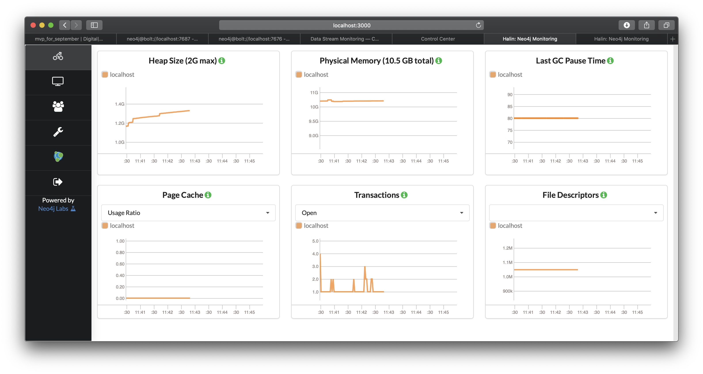

2. Open browser windows, navigate to `localhost:3000`, choose `7687` as Bolt port, type the neo4j password and access to `Halin` monitoring interface of `neo4j` instance. Click on `Cluster members` menuitem on the left menu.

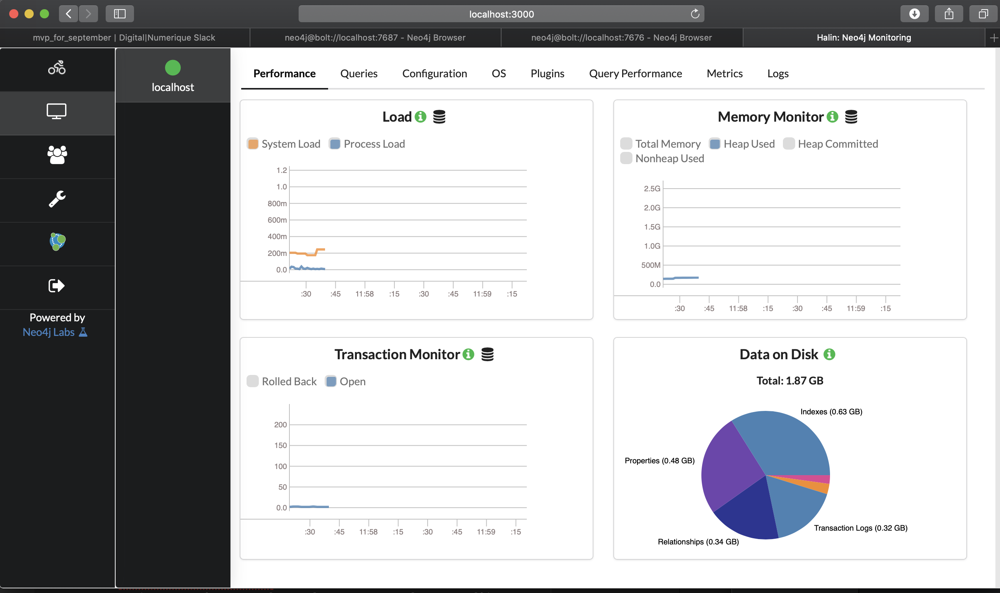

### 7. Monitoring Kafka via Control-Center:

Navigate with browser to `localhost:9021`

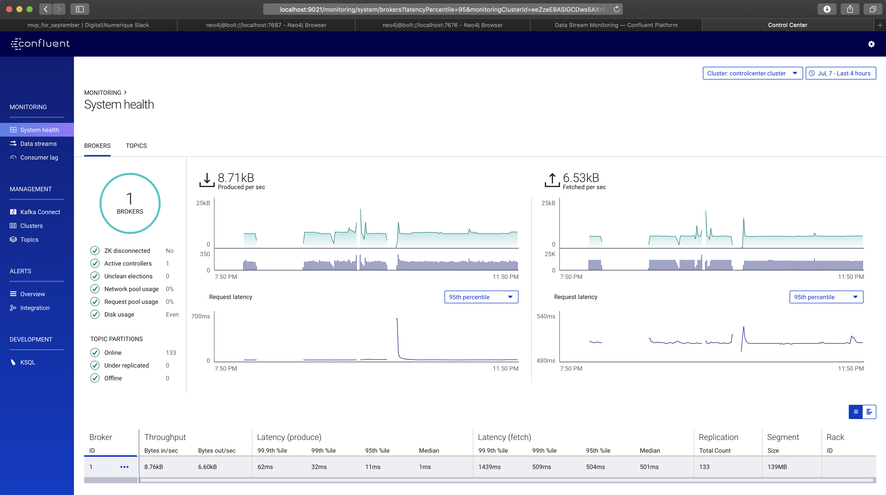

### 8. Visualizing the graph of dockers:

    ./visualize_docker_graph.sh

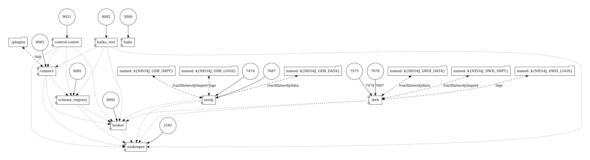    
