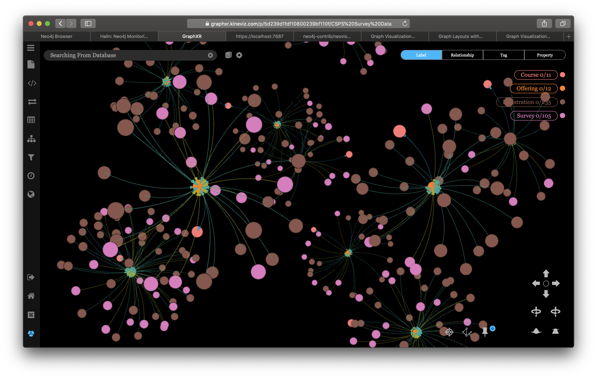

# Data visualization

## Visualizing graph data and interact with them

Graph data visualization not only consists of exploring graph entities and their relationships, but also using graph algorithms to detect important features.

There are several approaches for visualizations: casual explorers, data researchers, and developers. For each type of explorers, this session aims to provide an example case.

## How to use this repository?

### Setting up the environment:

1. Setup environment variables:

        ./set_env.sh

2. Get a compressed copy of [registration/survey Neo4j database](https://drive.google.com/open?id=1r4mc6piO86ELTtRFZP-c8a5qpac4LTU3) to, for example, local `Downloads` directory.

        mkdir neo4j/data
        mv ~/Download/csps_survey_gdb.tar.gz neo4j/data/.
        cd neo4j/data/
        tar xzvf csps_survey_gdb.tar.gz
        sudo chmod -R 777 databases

        (you might need to type your password here)

        rm csps_survey_gdb.tar.gz
        cd ../..

        (you should be in neo4j-training-sessions/session_5 now)

3. Build the dockers.

        docker-compose up

  Note 1: *to create a fresh build with latest images (wherever possible)*

        docker-compose up --build

  Note 2: during the build, when encounter errors, if you want to remove all containers, images, cleanup the system, use the following. Note that it would erase all containers and images, thus the build takes more time, so use it with caution.

        docker container rm -f $(docker container ls -aq)
        docker image rm -f $(docker image ls -aq)
        docker system prune

### 2. Visualizing with Neo4j Browser

Login to the browser at `localhost:7474` and use the following query:

    MATCH (c:Course)<-[:BUSINESS_TYPE_OF]-(business_type:BusinessType)
      WHERE business_type.name IN ['Instructor-Led', 'Events']
    WITH c
      MATCH (c)-[:COURSE_OF]->(o:Offering)-[:SURVEYED_FOR]->(s:Survey)
        WHERE o.start_date >= DATE('2019-04-03') AND o.start_date <= DATE('2019-04-05')
    WITH
      DISTINCT(o) AS o, c, COLLECT(DISTINCT(s)) AS survey_list
    WITH
      c, o, survey_list
        MATCH (o)-[:REGISTERED_FOR]->(r:Registration {status: 'Confirmed'})
    WITH
      DISTINCT(o) AS o, c, survey_list, COLLECT(DISTINCT(r)) AS registration_list
    WITH
      DISTINCT(c) AS c, COLLECT([o, survey_list, registration_list]) AS osr
    RETURN
        COLLECT([c, osr]) AS courses

  

### 3. Visualizing with GraphXR

Register an account at https://graphxr.kineviz.com/. It's free.

  

Login:

  

Create a new project by clicking on `Create +`:

  

Use the local instance `localhost` of Neo4j at `7687`, with given password.

  

Note: there would be a bit of confusing moments going back and forth with the browser.

  

Select the icon `</>`, and type the previous Cypher query.

Click the `>` play button and you should get a full graph of course, offerings, registrations, and surveys for the offerings between `2019-04-03` and `2019-04-05` of `Instructor-Led` and `Events` courses.

  

Zoomed out:

  

Customized:

  

### 4. Visualizing with Gephi

The Open Graph Viz Platform: `Gephi` is the leading visualization and exploration software for all kinds of graphs and networks. Gephi is open-source and free. Runs on Windows, Mac OS X and Linux.

Install [Gephi](https://gephi.org), then [Gephi streaming plugin](https://gephi.org/plugins/#/browse/search/streaming) by downloading them, open the `Plugin` menu and install them.

Open Gephi, create a new project, use the menu to change the name of the workspace from something like `Workspace 1` to `workspace0`.

In the `Streaming` tab, next to the `Layout`, choose `Master Server`, *right* click to start it.

In `Neo4j` browser, type the following query to start streaming result to Gephi. Note that it might not be successful if you have made changes to the project *before* starting the `Master Server` in Gephi, in that case, stop it and restart it.

All courses with offerings in between `2019-04-01` and `2019-04-30`

    MATCH (c:Course)<-[:BUSINESS_TYPE_OF]-(business_type:BusinessType)
      WHERE business_type.name IN ['Instructor-Led', 'Events']
    WITH c
      MATCH path=(c)-[:COURSE_OF]->(o:Offering)-[:SURVEYED_FOR]->(s:Survey)
        WHERE o.start_date >= DATE('2019-04-01') AND o.start_date <= DATE('2019-04-30')
    WITH DISTINCT(o) AS o, c, COLLECT(path) AS paths
    WITH c, o, paths
      MATCH path=(o)-[:REGISTERED_FOR]->(r:Registration {status: 'Confirmed'})
    WITH DISTINCT(o) AS o, c, paths + COLLECT(path) AS paths
    	CALL apoc.gephi.add('http://10.0.1.167:8080','workspace0', paths) yield nodes, relationships, time
    RETURN time

  

All instructors, courses, and offerings

    MATCH path=(i:Instructor)-[:INSTRUCTOR_OF]->(o:Offering)<-[:COURSE_OF]-(c:Course)
    WITH COLLECT(path) AS paths
      CALL apoc.gephi.add('http://10.0.1.167:8080','workspace0', paths) yield nodes, relationships, time
    RETURN time

  

### 5. Visualizing with Neovis.js

`Neovis.js` is used for creating JavaScript based graph visualizations that are embedded in a web app. It uses the `JavaScript Neo4j` driver to connect to and fetch data from Neo4j and a JavaScript library for visualization called `vis.js` for rendering graph visualizations. `Neovis.js` can also leverage the results of graph algorithms like `PageRank` and `community detection` for styling the visualization by binding property values to visual components.

In your browser open `index.html` file. Initialy it capture courses, registrations, and survey responses related to offerings on `2019-04-03` only, shown as below.

  

Preparation for displaying node properties:

    MATCH (o:Offering) WITH o MATCH (o)-[r:REGISTERED_FOR|SURVEY_FOR]->()
    WITH o, COUNT(DISTINCT(r)) AS rc
    SET o.size = rc;

    MATCH (c:Course) WITH c MATCH (c)-[r:COURSE_OF]->(:Offering)
    WITH c, COUNT(r) AS rc
      SET c.size = rc;

    MATCH (i:Instructor) WITH i MATCH (i)-[r:INSTRUCTOR_OF]->()
    WITH i, COUNT(DISTINCT(r)) AS rc
      SET i.size = rc;

A text input allows further exploration by using Cypher. Note that the nodes and relationships returned might not be styled.

    MATCH (o:Offering)
      WHERE o.start_date >= DATE('2019-04-03') AND o.start_date <= DATE('2019-04-03')
    WITH o
      MATCH (c:Course)-[r1:COURSE_OF]->(o)-[r2:SURVEYED_FOR]->(s:Survey)
    WITH c, r1, o, r2, s
      MATCH (o)-[r3:REGISTERED_FOR]->(r:Registration {status: 'Confirmed'})
    WITH c, r1, o, r2, s, r3, r
      MATCH (i:Instructor)-[r4:INSTRUCTOR_OF]->(o), (r)<-[r5:LEARNER_OF]-(l:Learner)
    RETURN c, r1, o, r2, s, r3, r, i, r4, r5, l;

  
