# Data visualization

## Visualizing graph data and interact with them

Graph data visualization not only consists of exploring graph entities and their relationships, but also using graph algorithms to detect important features.

There are several approaches for visualizations: casual explorers, data researchers, and developers. For each type of explorers, this session aims to provide an example case.

## How to use this repository?

### Setting up the environment:

1. Setup environment variables:

        ./set_env.sh

2. Get a compressed copy of [registration/survey Neo4j database](https://drive.google.com/open?id=1r4mc6piO86ELTtRFZP-c8a5qpac4LTU3) to the parent directory of `neo4j-training-sessions`.

3. Build the dockers.

        docker-compose up

  Note 1: *to create a fresh build with latest images (wherever possible)*

        docker-compose up --build

  Note 2: during the build, when encounter errors, if you want to remove all containers, images, cleanup the system, use the following. Note that it would erase all containers and images, thus the build takes more time, so use it with caution.

        docker container rm -f $(docker container ls -aq)
        docker image rm -f $(docker image ls -aq)
        docker system prune

4. Import, normalize, and create a backup

      ./data_tasks.sh snb

### 2. Exploring data by traversals, aggregations, and virtual graphs

1. Lookup for all offerings with `start_date` at `2019-04-03`, showing all courses of those offerings, instructors, languages, locations (city-province-region) in a graph.

    MATCH path=(c:Course)-[:COURSE_OF]->(o:Offering)
       WHERE o.start_date = DATE('2019-04-03')
    WITH c, o, COLLECT(path) AS paths
      MATCH path=(inst:Instructor)-[:INSTRUCTOR_OF]->(o)<-[:LANGUAGE_OF]-(lang:Language)
    WITH c, o, paths + COLLECT(path) AS paths
      MATCH path=(o)<-[:OFFERED_IN]-(o_cit)<-[:PROVINCE_OF]-(o_pro:Province)<-[:REGION_OF]-(o_reg:Region)
    RETURN paths + COLLECT(path) AS paths;

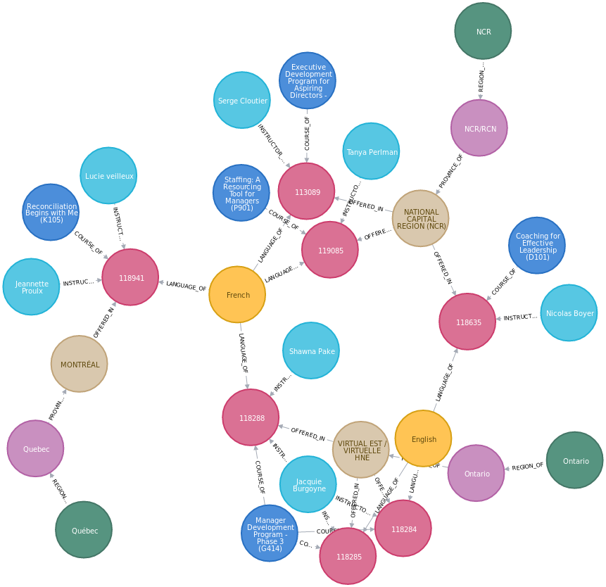

2. For course `G131` with offerings on `2019-04-05`, look at all registrations, learners, and locations of leaners.

        MATCH path=(c:Course {code: "G131"})-[:COURSE_OF]->(o:Offering)
          WHERE o.start_date = DATE('2019-04-05')
        WITH c, o, COLLECT(path) AS paths
          MATCH path=(o)-[:REGISTERED_FOR]->(r:Registration)<-[:LEARNER_OF]-(l:Learner)<-[:LOCATED_IN]-(l_cit)<-[:PROVINCE_OF]-(l_pro:Province)<-[:REGION_OF]-(l_reg:Region)
        RETURN paths + COLLECT(path) AS paths;

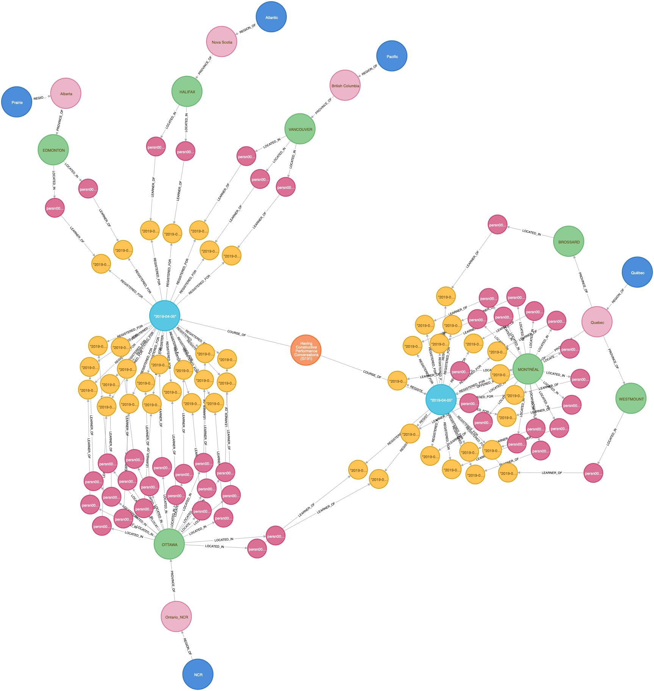

3. For course `G131` with offerings on `2019-04-05`, look at via a *virtual graph* of all locations of leaners.

        MATCH (c:Course {code: "G131"})-[:COURSE_OF]->(o:Offering)
           WHERE o.start_date = DATE('2019-04-05')
        WITH c, o
        	MATCH path=(o)-[:REGISTERED_FOR]->(r:Registration)<-[:LEARNER_OF]-(l:Learner)<-[:LOCATED_IN]-(city)<-[:PROVINCE_OF]-(prov:Province)<-[:REGION_OF]-(regi:Region)
        WITH DISTINCT(city), prov, regi, c, o, COUNT(*) AS rc
            CALL apoc.create.vRelationship(o,'LEANERS', {count: rc}, city) YIELD rel
        RETURN c, o, rel, city, prov, regi;

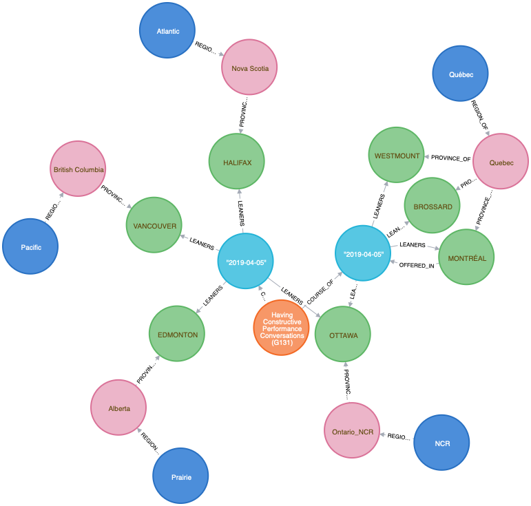

4. For course `G131` with offerings on `2019-04-05`, look at only confirmed registrations.

        MATCH (c:Course {code: "G131"})-[:COURSE_OF]->(o:Offering)
           WHERE o.start_date = DATE('2019-04-05')
        WITH c, o
          MATCH path=(o)-[:REGISTERED_FOR]->(r:Registration {status: "Confirmed"})
        WITH DISTINCT(r.date) AS d, COUNT(*) AS count, o, c
        RETURN o.uid AS offering, o.start_date AS start_date, o.end_date AS end_date, d AS registration_date, count ORDER BY offering, registration_date;

    |offering|start_date  |end_date    |registration_date|count|
    |---------|------------|------------|-----------------|-----|
    |118907   |"2019-04-05"|"2019-04-05"|"2019-02-15"     |1    |
    |118907   |"2019-04-05"|"2019-04-05"|"2019-03-01"     |1    |
    |118907   |"2019-04-05"|"2019-04-05"|"2019-03-22"     |22   |
    |118907   |"2019-04-05"|"2019-04-05"|"2019-04-11"     |1    |
    |119141   |"2019-04-05"|"2019-04-05"|"2019-02-28"     |5    |
    |119141   |"2019-04-05"|"2019-04-05"|"2019-03-05"     |1    |
    |119141   |"2019-04-05"|"2019-04-05"|"2019-03-06"     |2    |
    |119141   |"2019-04-05"|"2019-04-05"|"2019-03-07"     |1    |
    |119141   |"2019-04-05"|"2019-04-05"|"2019-03-20"     |1    |
    |119141   |"2019-04-05"|"2019-04-05"|"2019-03-26"     |4    |
    |119141   |"2019-04-05"|"2019-04-05"|"2019-04-03"     |1    |
    |119141   |"2019-04-05"|"2019-04-05"|"2019-04-04"     |1    |
    |119141   |"2019-04-05"|"2019-04-05"|"2019-04-08"     |1    |

5. For course `G131` with offerings on `2019-04-05`, look at only confirmed registrations in a *virtual graph* view.

        MATCH (c:Course {code: "G131"})-[:COURSE_OF]->(o:Offering)
           WHERE o.start_date = DATE('2019-04-05')
        WITH c, o
          MATCH path=(o)-[:REGISTERED_FOR]->(r:Registration {status: "Confirmed"})
        WITH DISTINCT(r.date) AS d, COLLECT(r) AS registrations, o, c
        WITH c, o, d, registrations
          CALL apoc.create.vNode(['Registrations'], {date: d}) YIELD node AS r
          CALL apoc.create.vRelationship(o, 'HAS', {count: SIZE(registrations)}, r) yield rel
        RETURN c, o, rel, r;

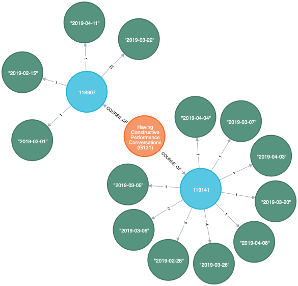

6. For course `G131` with offerings on `2019-04-05`, look at survey responses.

        MATCH (c:Course {code: "G131"})-[:COURSE_OF]->(o:Offering)
           WHERE o.start_date = DATE('2019-04-05')
        WITH c, o
        	MATCH path=(o)-[:SURVEYED_FOR]->(s:Survey)
        WITH DISTINCT(s.date) AS d, COUNT(*) AS count, o, c
        RETURN o.uid AS offering, o.start_date AS start_date, o.end_date AS end_date, d AS survey_date, count ORDER BY offering, survey_date;

    |offering|start_date  |end_date    |survey_date |count|
    |---------|------------|------------|------------|-----|
    |118907   |"2019-04-05"|"2019-04-05"|"2019-04-05"|2    |
    |119141   |"2019-04-05"|"2019-04-05"|"2019-04-05"|8    |

7. For course `G131` with offerings on `2019-04-05`, look at survey responses in a *virtual graph* view.

        MATCH (c:Course {code: "G131"})-[:COURSE_OF]->(o:Offering)
           WHERE o.start_date = DATE('2019-04-05')
        WITH c, o
          MATCH path=(o)-[:SURVEYED_FOR]->(s:Survey)
        WITH DISTINCT(s.date) AS d, COLLECT(s) AS surveys, o, c
        WITH c, o, d, surveys
          CALL apoc.create.vNode(['Surveys'], {date: d}) YIELD node AS r
          CALL apoc.create.vRelationship(o, 'HAS', {count: SIZE(surveys)}, r) yield rel
        RETURN c, o, rel, r;

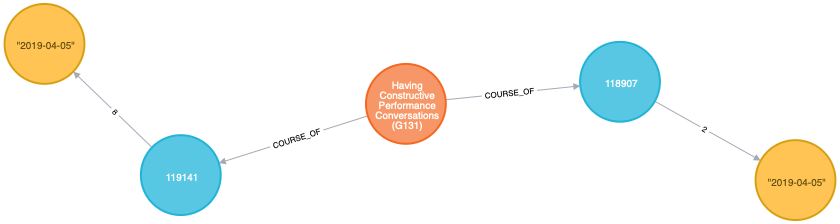

8. A combined view for course `G131` with offerings on `2019-04-05`

        MATCH (c:Course {code: "G131"})-[:COURSE_OF]->(o:Offering)
           WHERE o.start_date = DATE('2019-04-05')
        WITH c, o
        	MATCH path=(o)-[:REGISTERED_FOR]->(r:Registration {status: "Confirmed"})
        WITH DISTINCT(r.date) AS d, COUNT(*) AS count, o, c ORDER BY o.uid, d
        WITH c, o, COLLECT([TOSTRING(d), count]) AS rc,SUM (count) AS cr
        	MATCH path=(o)-[:SURVEYED_FOR]->(s:Survey)
        WITH DISTINCT(s.date) AS d, COUNT(*) AS count, o, c, rc, cr
        WITH c, o, rc, cr, COLLECT([TOSTRING(d), count]) AS sc, SUM (count) AS cs
        RETURN o.uid AS offering, o.start_date AS start_date, o.end_date AS end_date, rc AS registrations_per_day, cr AS total_registration, sc AS surveys_per_day, cs AS total_surveys ORDER BY offering;

    |offering|start_date  |end_date    |registrations_per_day                                                                                                                   |total_registration|surveys_per_day |total_surveys|
    |---------|------------|------------|----------------------------------------------------------------------------------------------------------------------------------------|------------------|----------------|-------------|
    |118907   |"2019-04-05"|"2019-04-05"|[[2019-02-15,1],[2019-03-01,1],[2019-03-22,22],[2019-04-11,1]]                                                                          |25                |[[2019-04-05,2]]|2            |
    |119141   |"2019-04-05"|"2019-04-05"|[[2019-02-28,5],[2019-03-05,1],[2019-03-06,2],[2019-03-07,1],[2019-03-20,1],[2019-03-26,4],[2019-04-03,1],[2019-04-04,1],[2019-04-08,1]]|17                |[[2019-04-05,8]]|8            |

9. A combined view for course `G131` with offerings on `2019-04-05` in *virtual graph* view.

        MATCH (c:Course {code: "G131"})-[:COURSE_OF]->(o:Offering)
           WHERE o.start_date = DATE('2019-04-05')
        WITH c, o
        	MATCH path=(o)-[:REGISTERED_FOR]->(r:Registration {status: "Confirmed"})
        WITH DISTINCT(r.date) AS d, COLLECT(r) AS registrations, o, c
        	CALL apoc.create.vNode(['Registrations'], {date: d}) YIELD node AS r
        	CALL apoc.create.vRelationship(o, 'HAS', {count: SIZE(registrations)}, r) yield rel
        WITH c, o, COLLECT([rel, r]) AS registrations_list
        WITH c, o, registrations_list
        	MATCH path=(o)-[:SURVEYED_FOR]->(s:Survey)
        WITH DISTINCT(s.date) AS d, COLLECT(s) AS surveys, o, c, registrations_list
        WITH c, o, registrations_list, d, surveys
        	CALL apoc.create.vNode(['Surveys'], {date: d}) YIELD node AS r
        	CALL apoc.create.vRelationship(o, 'HAS', {count: SIZE(surveys)}, r) yield rel
        RETURN c, o, registrations_list, COLLECT([rel, r]) AS surveys_list

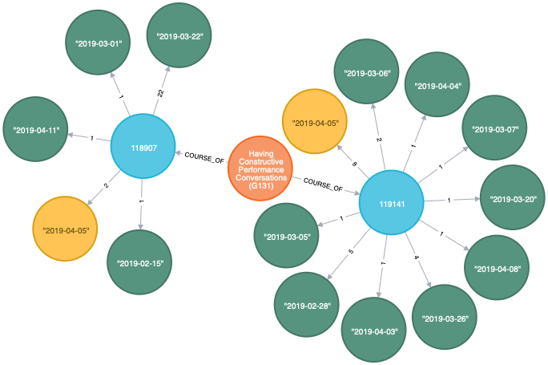

10. For course `G131` with offerings on `2019-04-05`, looking at leaner classifications.

        MATCH path=(c:Course {code: "G131"})-[:COURSE_OF]->(o:Offering)
           WHERE o.start_date = DATE('2019-04-05')
        WITH c, o, COLLECT(path) AS paths
        	MATCH path=(o)-[:REGISTERED_FOR]->(r:Registration {status: "Confirmed"})<-[:LEARNER_OF]-(l:Learner)<-[:CLASSIFICATION_OF]-(:Classification)<-[:CLASSIFICATION_GROUP_OF]-(:ClassificationGroup)
        RETURN paths + COLLECT(path) AS paths;

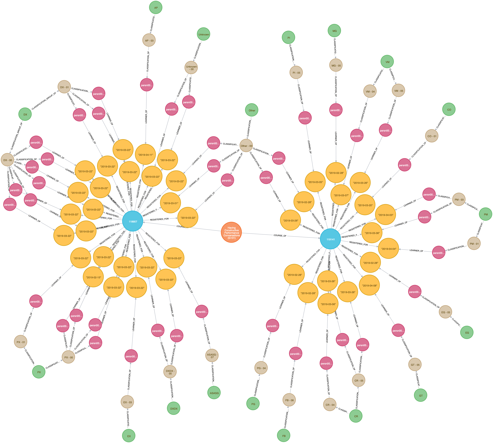

11. For course `G131` with offerings on `2019-04-05`, looking at survey responder classifications.

        MATCH path=(c:Course {code: "G131"})-[:COURSE_OF]->(o:Offering)
           WHERE o.start_date = DATE('2019-04-05')
        WITH c, o, COLLECT(path) AS paths
        	MATCH path=(o)-[:SURVEYED_FOR]->(:Survey)<-[:CLASSIFICATION_OF]-(:Classification)<-[:CLASSIFICATION_GROUP_OF]-(:ClassificationGroup)
        RETURN paths + COLLECT(path) AS paths;

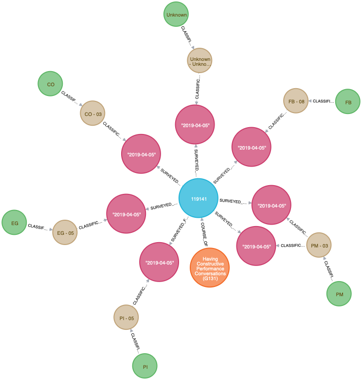

12. A combined view for course `G131` with offerings on `2019-04-05` at classifications in *virtual graph* view.

        MATCH path=(c:Course {code: "G131"})-[:COURSE_OF]->(o:Offering)
           WHERE o.start_date = DATE('2019-04-05')
        WITH c, o, COLLECT(path) AS paths
        	MATCH path=(o)-[:REGISTERED_FOR]->(r:Registration {status: "Confirmed"})<-[:LEARNER_OF]-(l:Learner)<-[:CLASSIFICATION_OF]-(:Classification)<-[:CLASSIFICATION_GROUP_OF]-(:ClassificationGroup)
        WITH c, o, paths + COLLECT(path) AS paths
        	MATCH path=(o)-[:SURVEYED_FOR]->(:Survey)<-[:CLASSIFICATION_OF]-(:Classification)<-[:CLASSIFICATION_GROUP_OF]-(:ClassificationGroup)
        RETURN paths + COLLECT(path) AS paths;

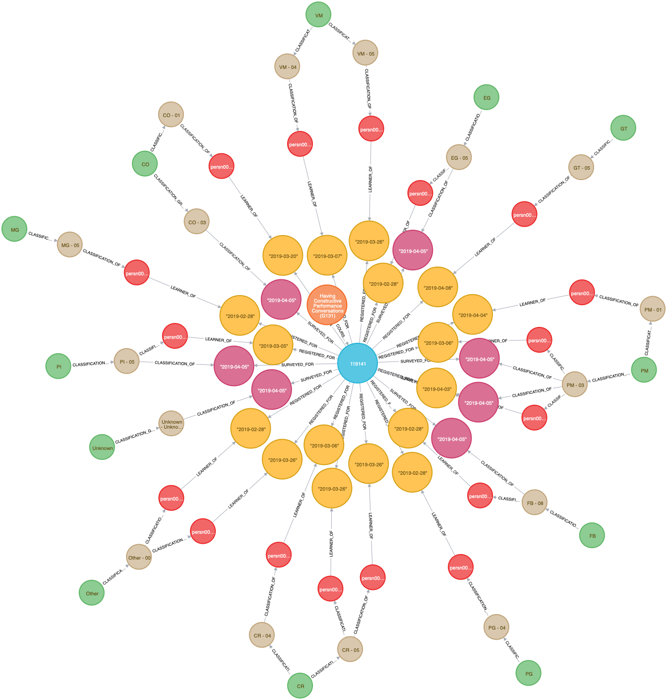

13. For course `G131` with offerings on `2019-04-05`, looking at departments of leaners.

        MATCH path=(c:Course {code: "G131"})-[:COURSE_OF]->(o:Offering)
           WHERE o.start_date = DATE('2019-04-05')
        WITH c, o, COLLECT(path) AS paths
          MATCH path=(o)-[:REGISTERED_FOR]->(r:Registration {status: "Confirmed"})<-[:LEARNER_OF]-(l:Learner)<-[:DEPARTMENT_OF]-(d:Department)
        RETURN paths + COLLECT(path) AS paths;

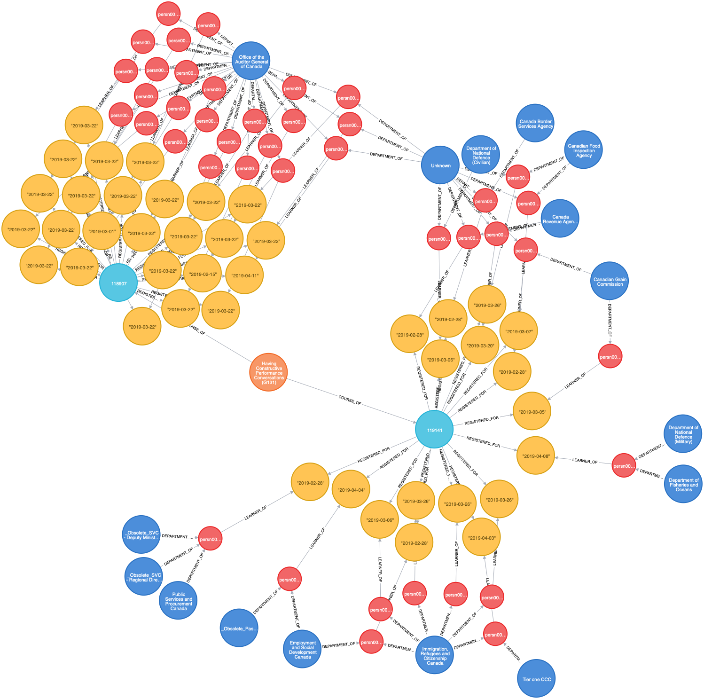

14. For course `G131` with offerings on `2019-04-05`, looking at departments of survey responders.

        MATCH path=(c:Course {code: "G131"})-[:COURSE_OF]->(o:Offering)
           WHERE o.start_date = DATE('2019-04-05')
        WITH c, o, COLLECT(path) AS paths
        	MATCH path=(o)-[:SURVEYED_FOR]->(s:Survey)<-[:DEPARTMENT_OF]-(d:Department)
        RETURN paths + COLLECT(path) AS paths;

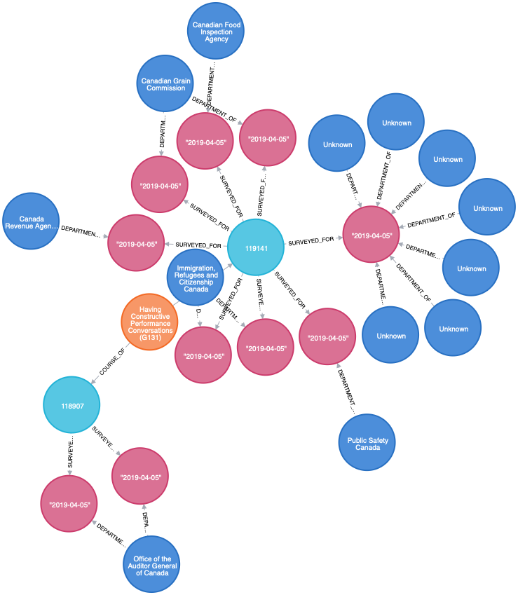

15. A combined view for course `G131` with offerings on `2019-04-05` at departments in *virtual graph* view.

        MATCH path=(c:Course {code: "G131"})-[:COURSE_OF]->(o:Offering)
           WHERE o.start_date = DATE('2019-04-05')
        WITH c, o, COLLECT(path) AS paths
        	MATCH path=(o)-[:REGISTERED_FOR]->(r:Registration {status: "Confirmed"})<-[:LEARNER_OF]-(l:Learner)<-[:DEPARTMENT_OF]-(d:Department)
        WITH c, o, paths + COLLECT(path) AS paths
        	MATCH path=(o)-[:SURVEYED_FOR]->(s:Survey)<-[:DEPARTMENT_OF]-(d:Department)
        RETURN paths + COLLECT(path) AS paths;

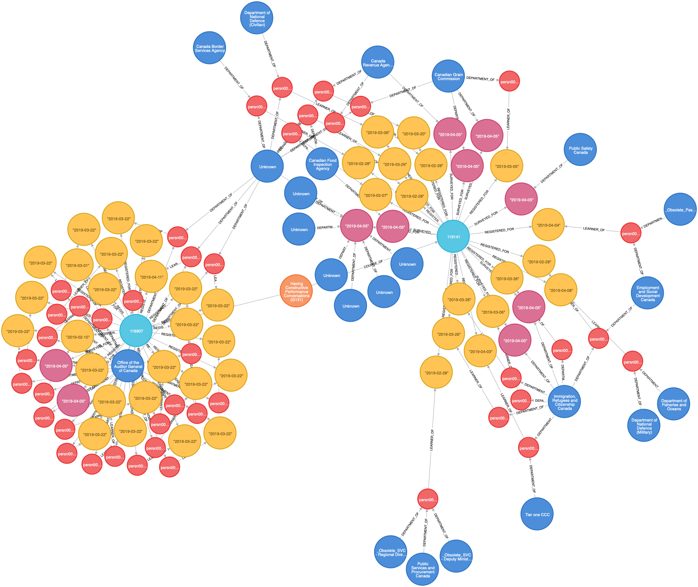

### 3. Using Neo4j graph algorithms to find centrality and detect communities

1. Top 5 instructors with most offerings.

        MATCH path=(i:Instructor)-[:INSTRUCTOR_OF|COURSE_OF*2]-(c:Course)
        WITH DISTINCT(c) AS c, i, COUNT(*) AS w
        WITH i, c, w
        	CALL apoc.create.vRelationship(i,'TEACHES', {weight: w}, c) YIELD rel
        WITH DISTINCT(i) AS i, COLLECT([rel, c]) AS cc
        RETURN i, cc ORDER BY SIZE(cc) DESC LIMIT 5;

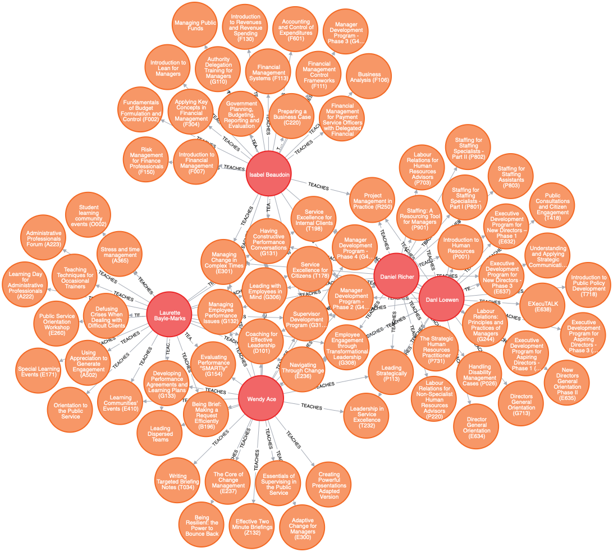

2. Top 5 instructors `teaching together with other instructors`.

        CALL algo.closeness.harmonic(
          'MATCH (i:Instructor) RETURN id(i) AS id',
          'MATCH (i1:Instructor)-[:INSTRUCTOR_OF*2]-(i2:Instructor) RETURN id(i1) as source, id(i2) as target',
          {graph:'cypher', writeProperty: 'centrality'}
        );

        MATCH (i:Instructor)
        WITH i ORDER BY i.centrality DESC LIMIT 5
        WITH i
        	MATCH (i)-[:INSTRUCTOR_OF*2]-(oi:Instructor)
        WITH DISTINCT(oi), i, COUNT(*) AS ic
          CALL apoc.create.vRelationship(i, 'COLLABORATE', {count: ic}, oi) yield rel
        RETURN i, oi, rel;

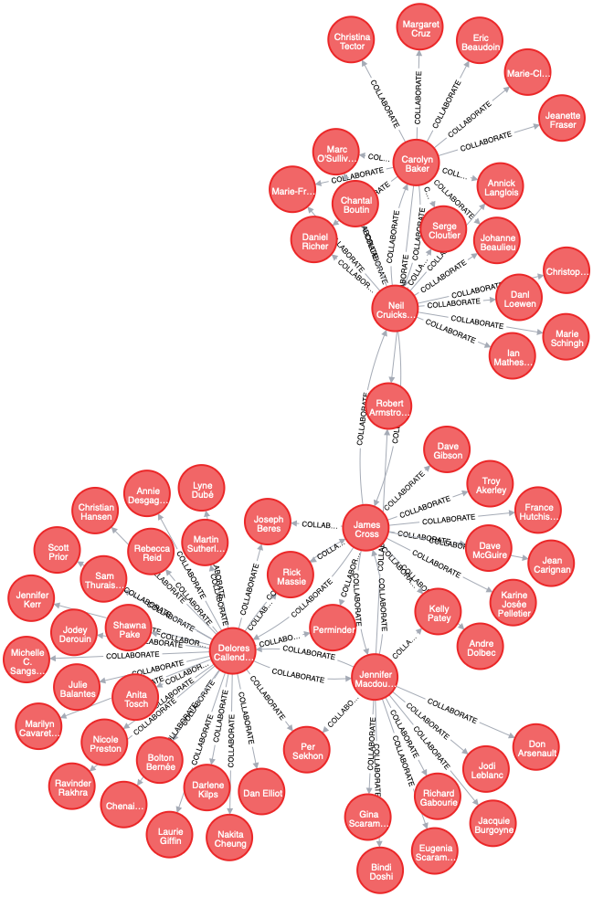      

3. Top 5 instructor communities - `group of instructors who used to teach together`.

        CALL algo.louvain(
          'MATCH (i:Instructor) RETURN id(i) AS id',
          'MATCH (i1:Instructor)-[r:INSTRUCTOR_OF*2]-(i2:Instructor) RETURN id(i1) AS source, id(i2) AS target, COUNT(DISTINCT(r)) AS weight',
          {graph:'cypher', write: true}
        );

        MATCH (i:Instructor)
        WITH DISTINCT(i.community) AS c, COLLECT(i) AS ic
        WITH c, ic
        	WHERE SIZE(ic) > 1
        WITH c, ic ORDER BY SIZE(ic) DESC LIMIT 5
        WITH c, apoc.coll.zip(REVERSE(TAIL(REVERSE(ic))), TAIL(ic)) AS pairs
        	UNWIND pairs AS pair
        WITH c, pair[0] AS i1, pair[1] AS i2
        	CALL apoc.create.vRelationship(i1, 'COLLABORATE', {count: c}, i2) yield rel
        RETURN i1, i2, rel;

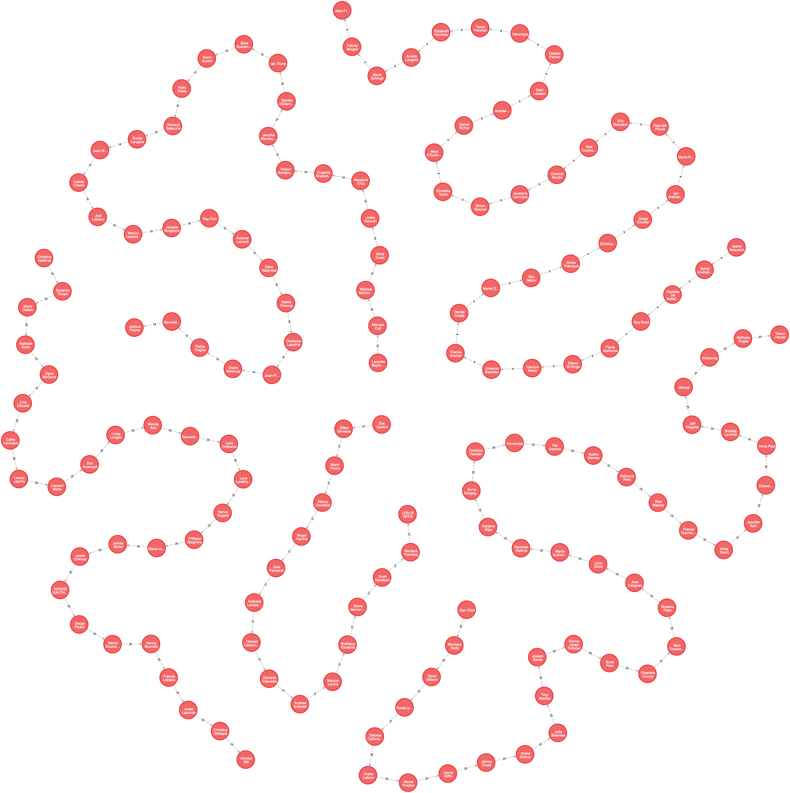 
