# The GRAND Stack

## Modern tools for building full stack apps

`GRANDstack` is a combination of technologies that work together to enable developers to build `data intensive full stack applications`. The components of `GRANDstack` are:

- [`GraphQL`](https://graphql.org/) - A new paradigm for building APIs, `GraphQL` is a way of describing data and enabling clients to query it.
- [`React`](https://reactjs.org/) - A `JavaScript` library for building component based reusable user interfaces.
- [`Apollo`](https://www.apollographql.com) - A suite of tools that work together to create great `GraphQL` workflows.
- [`Neo4j`](https://neo4j.com/) Database - The native graph database that allows you to model, store, and query your data the same way you think about it: as a graph.

## How to use this repository?

### Using `Neo4j GraphQL Database Plugin`:

1. Getting the CSPS course/registration/survey database ready:

        source ./set_env.sh

- *Option 1* (preferable for Windows): Download a [copy of the database](https://drive.google.com/open?id=1hq8GLQYRRDwH2oKzeebdxU-kznIiCsAc), uncompress, and place it under `neo4j/data` as `database`. Run:

        docker-compose -f docker-compose.yml.with-plugin up

- *Option 2 (recommended)* (preferable if you want to know the data import, conversion, and normalization process): Download the [scraped data](https://drive.google.com/open?id=1L_qXTCLYg_Dc4E4FY9cCZ8_RXHSWDKT-) in `tsv` format, uncompress, and place the files in `neo4j/import/csps`.

  *Important: Make sure that `python3` is installed and executable. If you use python virtual environment, enable it.*

  Run:

        ./data_task neib

  This will perform data normalization, preparation, import, temporal data conversion, as well as entity extractions for incomplete data of GoC occupation classification & department.

- Navigate to [Neo4j local instance](http://localhost:7474) and login. To visualize the `GraphQL` schema of your database, type:

      CALL graphql.schema()

  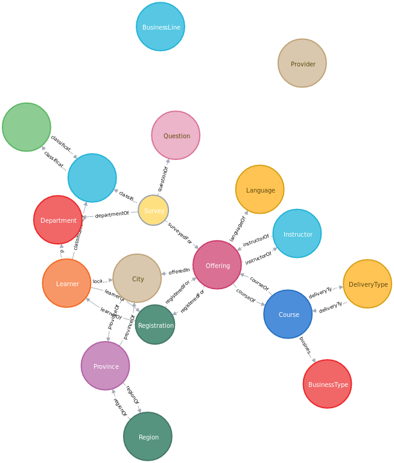

- Get the string representation of the current schema:

      RETURN graphql.getIdl()

2. Running `GraphQL` queries as `Cypher` ones.

  Simple query:

        CALL graphql.query('{ Course(code: "G131") { _id code title } }')

  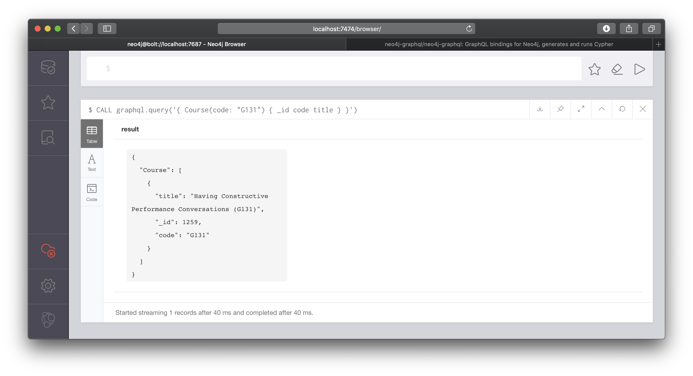

  Query *_* related entities:

        WITH 'query ($code:String) { Course(code:$code) { code title courseOf(first:5) {uid start_date end_date} } }' AS query
        CALL graphql.query(query, {code: "G131"})
          YIELD result
        UNWIND result.Course as course
        RETURN course.code, course.title, [o IN course.courseOf | [o.uid, o.start_date, o.end_date]] AS offerings

  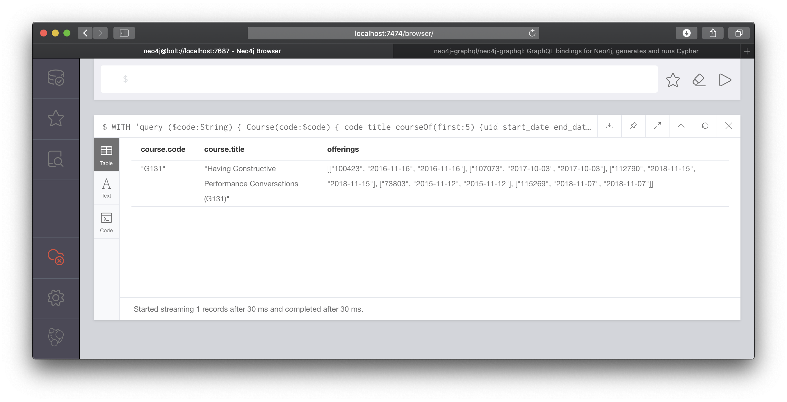

  Mutation:

        CALL graphql.execute('mutation { createCourse(code:"007", title:"How to become James Bond")}')

  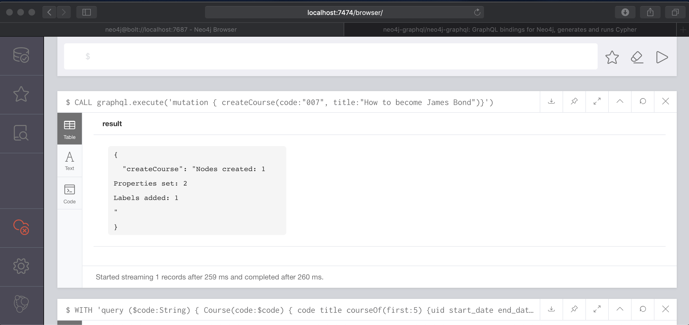

  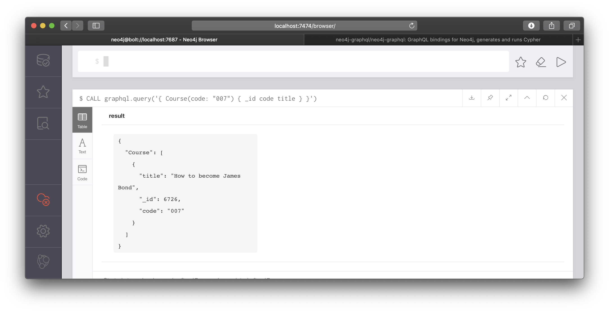

3. Using the `Neo4j-GraphQL` `database plugin`, explore `CSPS` database using `GraphiQL`.

- First, download the `Electron`-based [`GraphiQL.app`](https://electronjs.org/apps/graphiql). Follow installation instructions.

- Start the app, click on `Edit HTTP Headers`, `Add Header`.
  + Type: `Authorization` into `Header name` and `Basic bmVvNGo6IyNkaXNAZGEyMDE5IyM=` into `Header value`.
  + If you are not using default password, you can generate a `based64` encoded string by running this in the shell:

        echo "Basic $(echo -n "neo4j:<neo4j_password>" | base64)"

- In the `Query` box, type the following:

      query CourseQuery($code: String!) {
        Course(code: $code) {
          code
          title
        }
      }
  In the `Query variables` box, type:

      {
        "code": "G414"
      }

  You should be able to see in the `Result` box:

      {
        "data": {
          "Course": [
            {
              "code": "G414",
              "title": "Manager Development Program - Phase 3 (G414)"
            }
          ]
        },
        "extensions": {
          "type": "READ_ONLY"
        }
      }

  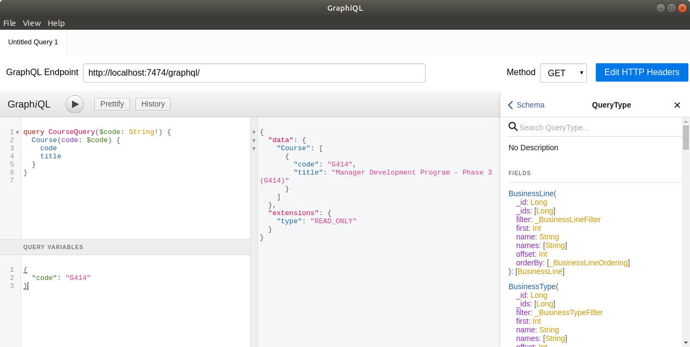

- Dynamic queries can also be executed as following:

  Query for a `Course` with `Offering` location and `Instructor` information:

      query CourseWithOfferings($code: String!) {
        Course(code: $code) {
          code
          title
      		courseOf {
            uid
            offeredIn {
              name
              provinceOf {
                name
                regionOf {
                  name
                }
              }
            }
            instructorOf {
              name
            }
          }
        }
      }

  Same variable for `Query` `code`:

      {
        "code": "G414"
      }

  And more detailed results:

      {
        "data": {
          "Course": [
            {
              "code": "G414",
              "title": "Manager Development Program - Phase 3 (G414)",
              "courseOf": [
                {
                  "uid": "111825",
                  "offeredIn": {
                    "name": "VIRTUAL EST / VIRTUELLE HNE",
                    "provinceOf": {
                      "name": "Ontario",
                      "regionOf": {
                        "name": "Ontario"
                      }
                    }
                  },
                  "instructorOf": {
                    "name": "Jacquie Burgoyne"
                  }
                },
                {
                  "uid": "100459",
                  "offeredIn": {
                    "name": "NATIONAL CAPITAL REGION (NCR)",
                    "provinceOf": {
                      "name": "NCR/RCN",
                      "regionOf": {
                        "name": "NCR"
                      }
                    }
                  },
                  "instructorOf": {
                    "name": "Karen Wienberg"
                  }
                },  
                ...
  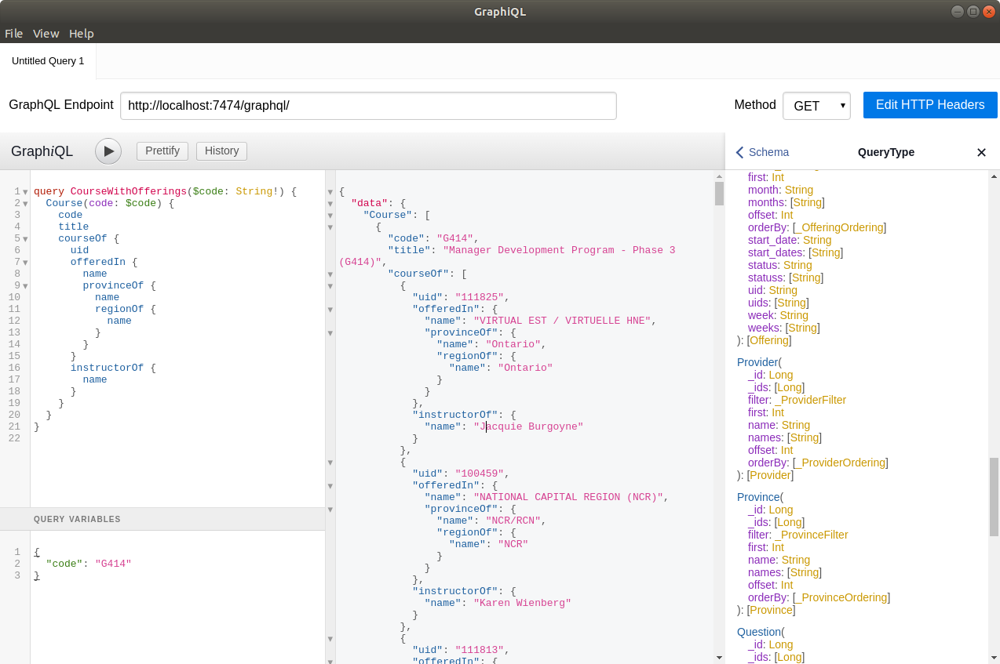

- Creating a custom query with `@cypher` `directive`:

  In `Neo4j` browser:

      CALL graphql.idl('
      schema {
         query: CoursesOfInstructor
      }
      type CoursesOfInstructor  {
        coursesOfInstructor(name:String!): [Course] @cypher(statement:"MATCH (i:Instructor {name: $name})-[:INSTRUCTOR_OF]-()-[:COURSE_OF]-(c:Course) RETURN c")
      }
      ');

  In `GraphiQL` query:

      query q($instructor_name: String!) {
        coursesOfInstructor(name: $instructor_name) {
          code
          title
        }
      }

  As `GraphiQL` variable:

      {
        "instructor_name": "Benoit Le Blanc"
      }

  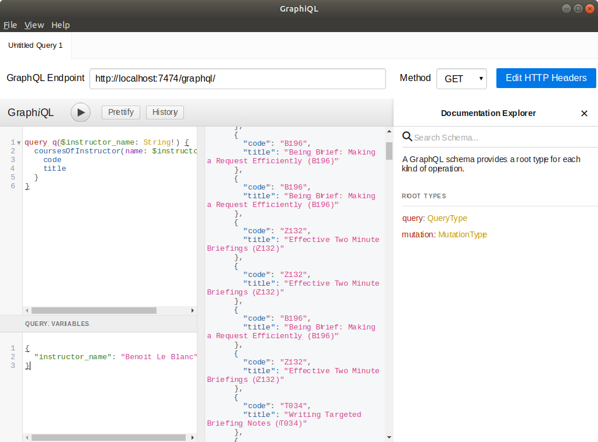

### Using `neo4j-graphql.js` with `Apollo Server`:

1. Cleanup

        ./cleanup_docker.sh docker-compose.yml.with-plugin

  (optional)
  
        ./data_task.sh ib

2. Start `neo4j-session-7` and `apollo-server` docker containers:

        docker-compose -f docker-compose.yml.with-apollo up -d --build neo4j-session-7
        docker-compose -f docker-compose.yml.with-apollo up -d --build  apollo-server

3. Use `GraphiQL` and make a query to `http://localhost:4000/`

        query {
          Course(code: "G414") {
            code
            title
          }
        }

  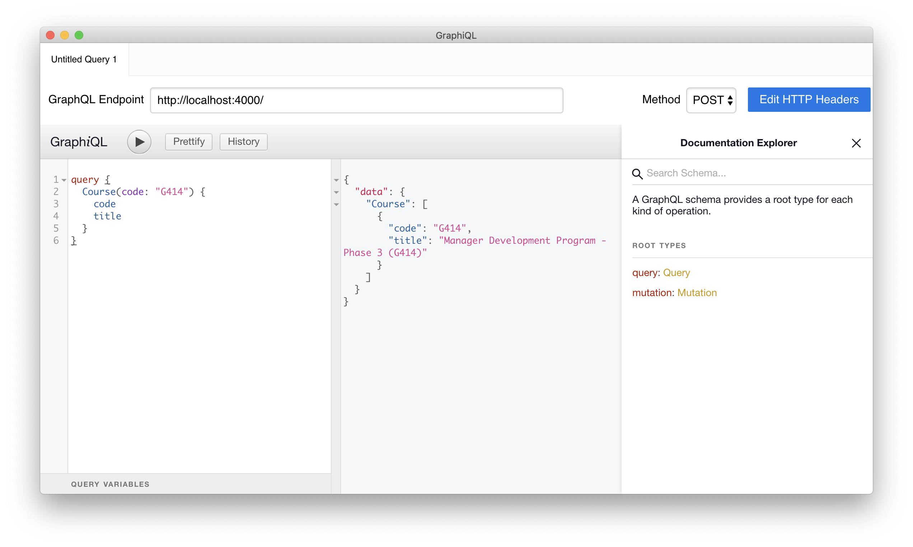

- Note that auto-generated queries and resolvers might differ from `Neo4j GraphQL plugin`

  Query:
      query CourseWithOfferings($code: String!) {
        Course(code: $code) {
          code
          title
          course_of {
            uid
            citys {
              name
              provinces {
                name
                regions {
                  name
                }
              }
            }
            instructors {
              name
            }
          }
        }
      }

  Variable:

      {
        "code": "G414"
      }      

  Result:

  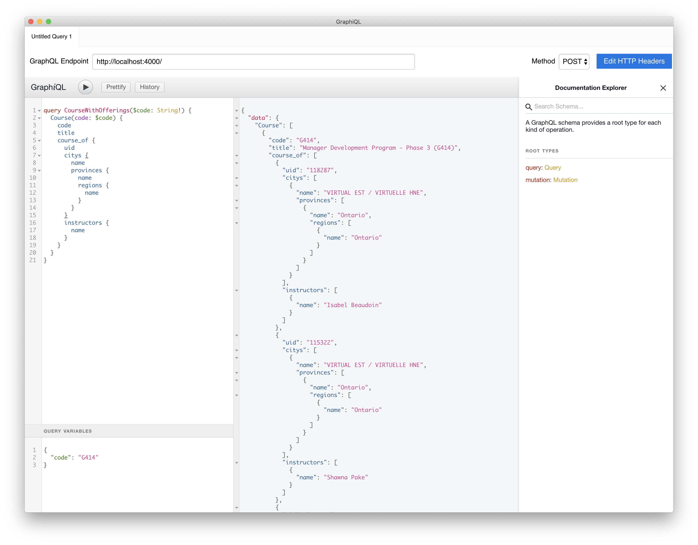

### Enabling `Apollo Client` to access the backend:

      docker-compose -f docker-compose.yml.with-apollo up --build apollo-client

  With simple `query`-on-`render`:

    query coursePaginateQuery(
      $first: Int
      $offset: Int
      $orderBy: [_CourseOrdering]
    ) {
      Course(first: $first, offset: $offset, orderBy: $orderBy) {
        _id
        code
        title
      }
    }

  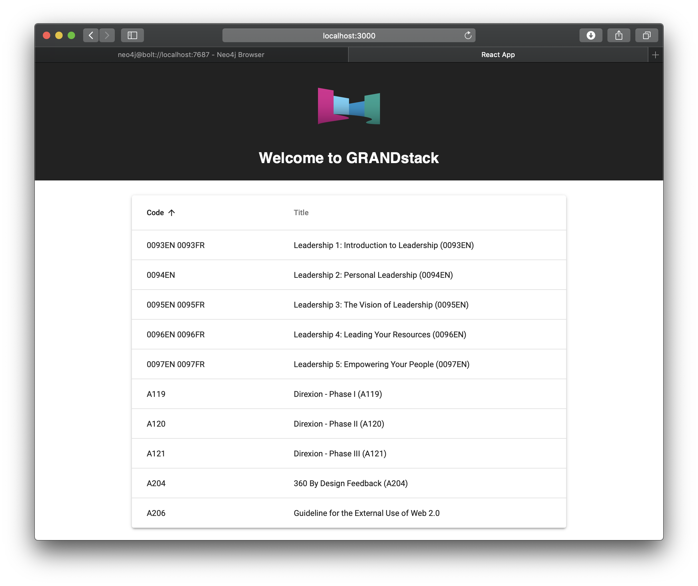

  With column sorting:

  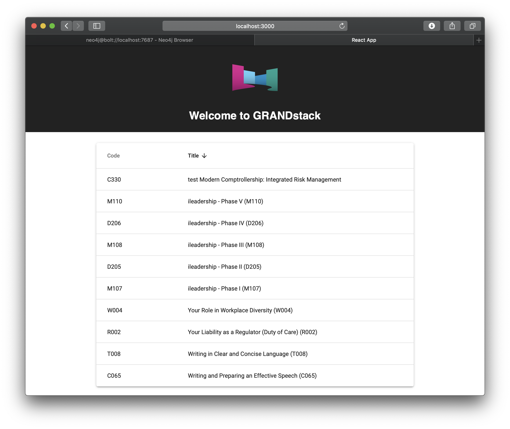

  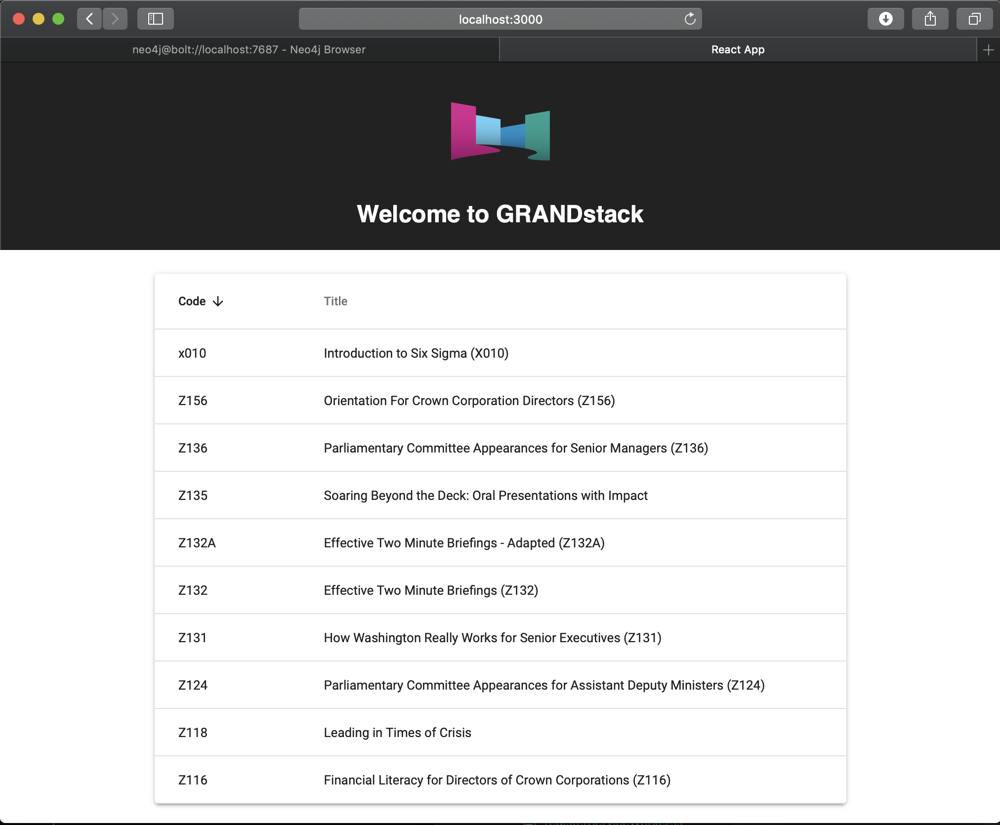
