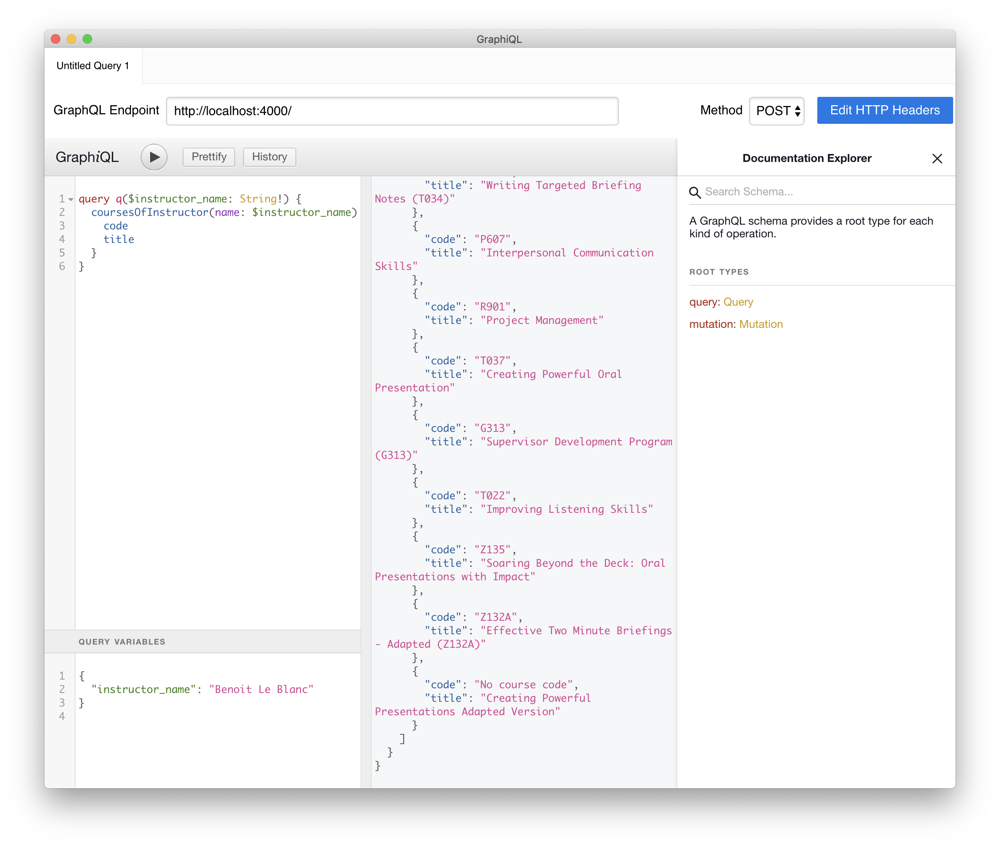

# Visualizing CSPS data in Grand Stack application

## Demonstrating concepts of visualizing CSPS data

- CSPS data consists of course/offering/registration/learner/survey/etc entities

- `GRANDstack` is a combination of technologies that work together to enable developers to build `data intensive full stack applications`.

## How to use this repository?

### Getting the database ready:

1. Getting the CSPS course/registration/survey database ready:

        source ./set_env.sh

- *Option 1* (preferable for Windows): Download a [copy of the database](https://drive.google.com/open?id=1hq8GLQYRRDwH2oKzeebdxU-kznIiCsAc), uncompress, and place it under `neo4j/data` as `database`. Run:

        docker-compose up --build neo4j-session-8

- *Option 2 (recommended)* (preferable if you want to know the data import, conversion, and normalization process): Download the [scraped data](https://drive.google.com/open?id=1L_qXTCLYg_Dc4E4FY9cCZ8_RXHSWDKT-) in `tsv` format, uncompress, and place the files in `neo4j/import/csps`.

  *Important: Make sure that `python3` is installed and executable. If you use python virtual environment, enable it.*

  Run:

        ./data_task neib

  This will perform data normalization, preparation, import, temporal data conversion, as well as entity extractions for incomplete data of GoC occupation classification & department.

### Starting Neo4j, Apollo-Server, Apollo-Client

      docker-compose up

- Test if GraphQL *augmented schema* is working:

  Use `GraphiQL` app at endpoint "http://localhost:4000/", with query:

      query q($instructor_name: String!) {
      	CoursesOfInstructor(name: $instructor_name) {
        	code
          title
      	}
      }

  and variable

      {
        "instructor_name": "Benoit Le Blanc"
      }

  to obtain the following result:

  
