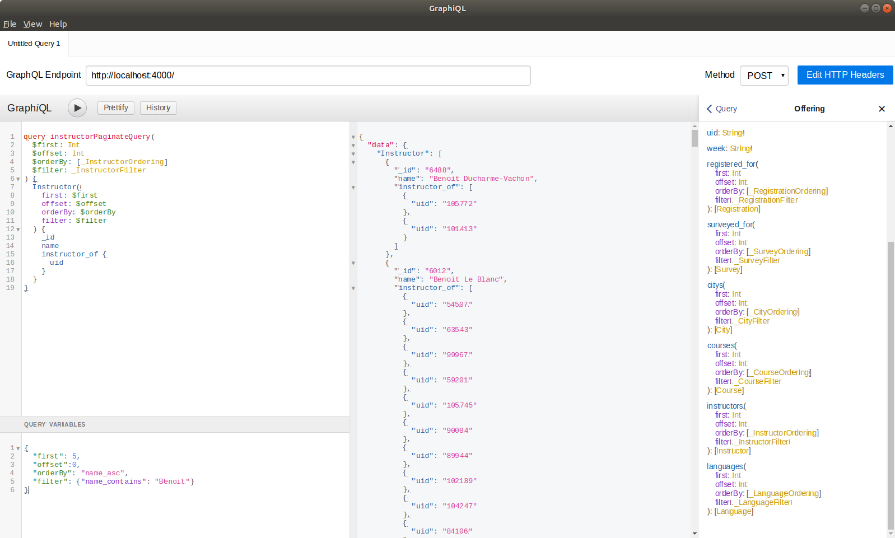
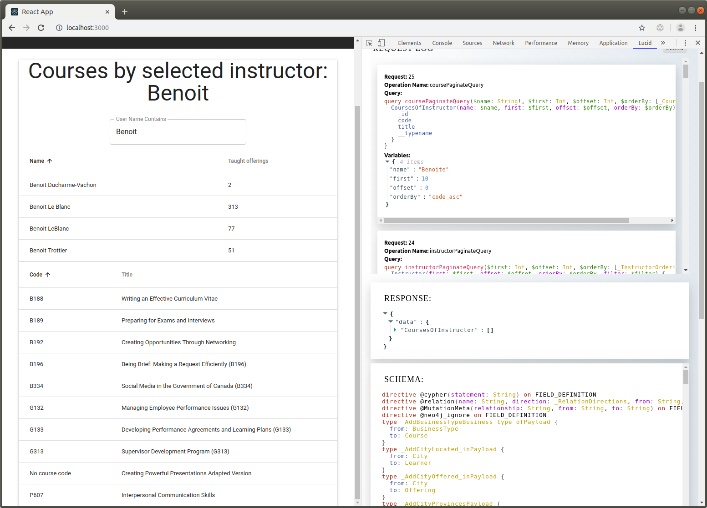

# Visualizing CSPS data in Grand Stack application

## Demonstrating concepts of visualizing CSPS data

- CSPS data consists of course/offering/registration/learner/survey/etc entities

- `GRANDstack` is a combination of technologies that work together to enable developers to build `data intensive full stack applications`.

## How to use this repository?

### A. Testing Kafka

    docker-compose -f docker-compose-for-testing.yml up --build yggdrasil_zookeeper yggdrasil_broker yggdrasil_schema_registry

#### 1. Console clients with `json` messages

In one terminal:

    ./test_json_producer.sh json-topic

  (type you messages, line by line)

      my message number 1
      my message number 2
      ...

In another terminal:

    ./test_json_consumer.sh json-topic

  (you should see the messages coming here)

#### 2. Console clients with `avro` messages

In one terminal:

    ./test_avro_producer.sh avro-topic '{"type":"record","name":"User","fields":[{"name":"name","type":"string"}, {"name":"surname","type":"string"}]}'

  (type you messages, line by line)

    {"name": "X", "surname": "Man"}
    {"name": "X", "surname": "Woman"}
    ...

In another terminal:

    ./test_avro_consumer.sh avro-topic

  (you should see the messages coming here)

#### 3. C++ wrapper and pure `Node.js` clients

  Note: *Tested on Mac OS X Mojave, and Ubuntu Linux 18.04*

Follow instructions on [nodefluent/node-sinek](https://github.com/nodefluent/node-sinek) to install `sinek` and [`node-rdkafka`](https://github.com/Blizzard/node-rdkafka) on target machine.

- On Mac OS X:

      brew install librdkafka
      brew install openssl

      # Add to your shell profile:
      export CPPFLAGS=-I/usr/local/opt/openssl/include
      export LDFLAGS=-L/usr/local/opt/openssl/lib

      npm install --save sinex

- On Ubuntu Linux 18.04

      sudo apt-get install python libsasl2-dev make g++ gcc libc-dev
      npm install --save sinex

- Run tests with `node-rdkafka`-based (native C++ wrapper) clients:

      node test_native_node_producer.js
  (it will publish automatically a message)

      node test_native_node_consumer.js
  (the consumed message will be displayed)

- Run tests with pure JavaScript clients:

      node test_pure_node_producer.js
  (it will publish automatically a message)

      node test_pure_node_consumer.js
  (the consumed message will be displayed)

#### 4. Dockerized `Node.js` clients

  Note: *Tested on Mac OS X Mojave, Ubuntu Linux 18.04, and Windows 10*

    docker-compose up --build node_producer

    docker-compose up --build node_consumer

#### 5. Cleanup testing environment

    ./cleanup_docker.sh docker-compose.yml-for-testing

### B. Getting the database ready:

1. Getting the CSPS course/registration/survey database ready:

        source ./set_env.sh

- *Option 1* (preferable for Windows): Download a [copy of the database](https://drive.google.com/open?id=1hq8GLQYRRDwH2oKzeebdxU-kznIiCsAc), uncompress, and place it under `~/neo4j/data` as `database`. Run:

        docker-compose up -d --build jotunheimr

- *Option 2 (recommended)* (preferable if you want to know the data import, conversion, and normalization process): Download the [scraped data](https://drive.google.com/open?id=1L_qXTCLYg_Dc4E4FY9cCZ8_RXHSWDKT-) in `tsv` format, uncompress, and place the files in `~/neo4j/import/csps`.

  *Important: Make sure that `python3` is installed and executable. If you use python virtual environment, enable it.*

  Run:

        ./data_task neib

  This will perform data normalization, preparation, import, temporal data conversion, as well as entity extractions for incomplete data of GoC occupation classification & department.

### C. Starting jotunheimr, gungnir, valhalla

  (in each terminal)

      docker-compose up -d --build jotunheimr
      docker-compose up -d --build gungnir
      docker-compose up -d --build valhalla

- Test if GraphQL *augmented schema* is working:

  Use `GraphiQL` app at endpoint "http://localhost:4000/", with query `CoursesOfInstructor` defined as custom query in `gungnir`:

      query q($instructor_name: String!) {
      	CoursesOfInstructor(name: $instructor_name) {
        	code
          title
      	}
      }

  and variable

      {
        "instructor_name": "Benoit Le Blanc"
      }

  to obtain the following result:

  

  Query for instructors, using `neo4j-graphql-js` `auto-generated` `queries` and `mutations`;

      query instructorPaginateQuery(
        $first: Int
        $offset: Int
        $orderBy: [_InstructorOrdering]
        $filter: _InstructorFilter
      ) {
        Instructor(
          first: $first
          offset: $offset
          orderBy: $orderBy
          filter: $filter
        ) {
          _id
          name
          instructor_of {
            uid
          }
        }
      }

  with variables

      {
        "first": 5,
        "offset":0,
        "orderBy": "name_asc",
        "filter": {"name_contains": "Benoit"}
      }

- Use [`Lucid`](https://reactlucid.io/) to monitor and track requests & responses. You need Chrome browser to install the extension.

  Open the `Lucid` extension in `Developer Tools` and then direct the browser to `http://localhost:3000`.

__
