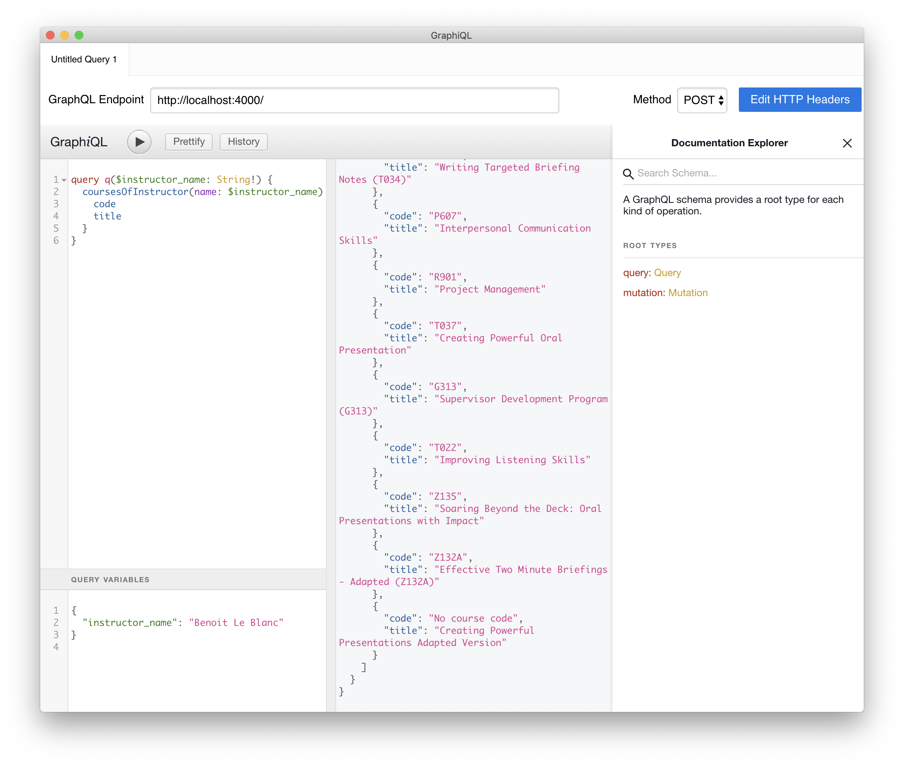
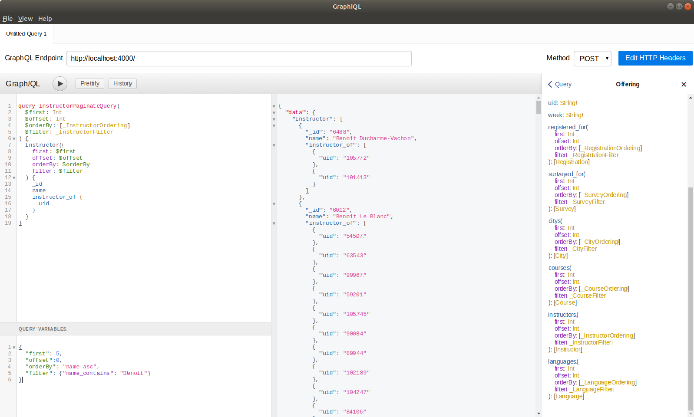
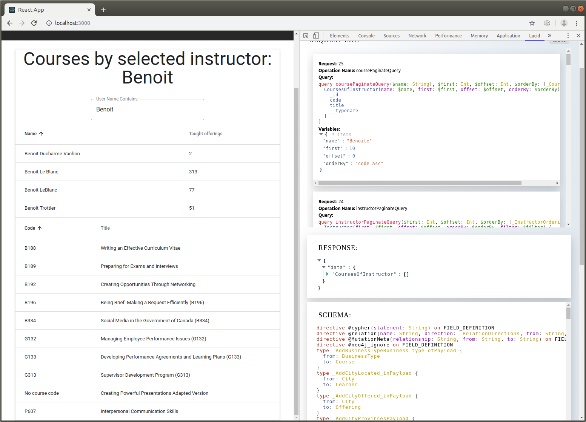
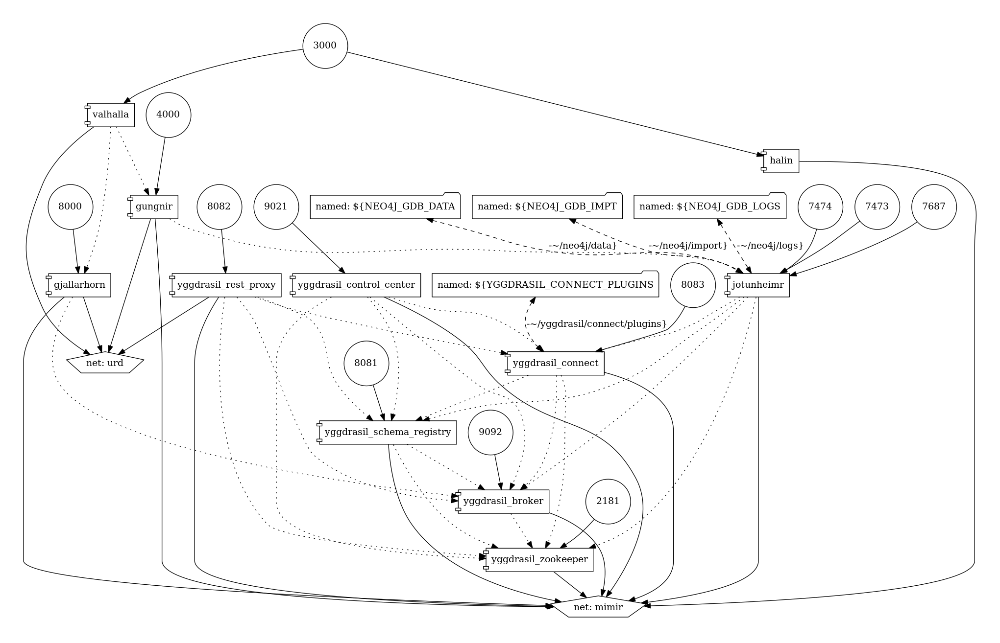

# Streaming and visualizing data

## Demonstrating concepts of streaming and visualizing data

- CSPS data consists of course/offering/registration/learner/survey/etc entities

- `GRANDstack` is a combination of technologies that work together to enable developers to build `data intensive full stack applications`.

## How to use this repository?

First install `docker` and `docker-compose`.

### A. Testing Kafka

    docker-compose -f docker-compose-for-testing.yml up --build yggdrasil_zookeeper yggdrasil_broker yggdrasil_schema_registry

#### 1. Console clients with `json` messages

In one terminal:

    ./test_json_producer.sh json-topic

  (type you messages, line by line)

      my message number 1
      my message number 2
      ...

In another terminal:

    ./test_json_consumer.sh json-topic

  (you should see the messages coming here)

#### 2. Console clients with `avro` messages

In one terminal:

    ./test_avro_producer.sh avro-topic '{"type":"record","name":"User","fields":[{"name":"name","type":"string"}, {"name":"surname","type":"string"}]}'

  (type you messages, line by line)

    {"name": "X", "surname": "Man"}
    {"name": "X", "surname": "Woman"}
    ...

In another terminal:

    ./test_avro_consumer.sh avro-topic

  (you should see the messages coming here)

#### 3. C++ wrapper and pure `Node.js` clients

  Note: *Tested on Mac OS X Mojave, and Ubuntu Linux 18.04*

Follow instructions on [nodefluent/node-sinek](https://github.com/nodefluent/node-sinek) to install `sinek` and [`node-rdkafka`](https://github.com/Blizzard/node-rdkafka) on target machine.

- On Mac OS X:

      brew install librdkafka
      brew install openssl

      # Add to your shell profile:
      export CPPFLAGS=-I/usr/local/opt/openssl/include
      export LDFLAGS=-L/usr/local/opt/openssl/lib

      npm install --save sinex

- On Ubuntu Linux 18.04

      sudo apt-get install python libsasl2-dev make g++ gcc libc-dev
      npm install --save sinex

- Run tests with `node-rdkafka`-based (native C++ wrapper) clients:

      node test_native_node_producer.js
  (it will publish automatically a message)

      node test_native_node_consumer.js
  (the consumed message will be displayed)

- Run tests with pure JavaScript clients:

      node test_pure_node_producer.js
  (it will publish automatically a message)

      node test_pure_node_consumer.js
  (the consumed message will be displayed)

#### 4. Dockerized `Node.js` clients

  Note: *Tested on Mac OS X Mojave, Ubuntu Linux 18.04, and Windows 10*

    docker-compose up --build test_node_producer

    docker-compose up --build test_node_consumer

#### 5. Cleanup testing environment

    ./cleanup_docker.sh docker-compose.yml-for-testing

### B. Getting ready:

#### 0. (Optional) Prerequisites for Windows users

- Install [`git` clients for Windows](https://git-scm.com/download/win). Just download the package and follow installation instructions.
- Open a `Git Bash` terminal. Install [`win-sudo`](https://github.com/imachug/win-sudo) by:

      curl -s https://raw.githubusercontent.com/imachug/win-sudo/master/install.sh | sh

#### 1. Get `Kafka Connect Neo4j Sink` from `Confluent`:

    ./install_kafka_plugin.sh

The script downloads `neo4j-kafka-connect-neo4j-1.0.3.zip` from [neo4j-streams-3.5.3](https://github.com/neo4j-contrib/neo4j-streams/releases/download/3.5.3/) and expands it in `~/yggdrasil/connect/plugins` sub-directory.

*Note: on Windows it will prompt for granting administrative privileges*

For more information: [Kafka Connect Neo4j Sink](https://www.confluent.io/connector/kafka-connect-neo4j-sink/)

#### 2. Getting the CSPS course/registration/survey database ready:

- Start `jotunheimr`

      docker-compose build jotunheimr

##### 2.1 Using `neo4j-admin` high-performance `import`

- Download the [scraped data](https://drive.google.com/open?id=1L_qXTCLYg_Dc4E4FY9cCZ8_RXHSWDKT-), uncompress, and place the `*.tsv` files in `~/neo4j/import/csps`.

- Make sure that `python3` is installed and executable. If you use python virtual environment, for example at `~3.7.4`, enable it:

  Mac OS X, Linux:

      source ~/3.7.4/bin/activate

  Windows (`git bash`)

      source ~/3.7.4/Scripts/activate

- Perform data normalization, preparation, import, temporal data conversion, as well as entity extractions for incomplete data of GoC occupation classification & department:

      ./data_import.sh neias ~/neo4j

##### 2.2 Using `LOAD CSV` for import

- Download the [scraped data](https://drive.google.com/open?id=1L_qXTCLYg_Dc4E4FY9cCZ8_RXHSWDKT-), uncompress, and place the `*.tsv` files in `~/neo4j/import/csps`.

- Perform a full import directly from `*.tsv` files and performing data normalization, preparation, import, temporal data conversion, as well as entity extractions for incomplete data of GoC occupation classification & department:

      ./tsv_import.sh

#### C. Norse mythology

#### 1. `jotunheimr`

    docker-compose up -d --build jotunheimr

- Navigate to [Neo4j local instance](http://localhost:7474) and login. To visualize the `GraphQL` schema of your database, type:

      CALL graphql.schema()

- Get the string representation of the current schema:

      RETURN graphql.getIdl()

#### 2. `gungnir`

    docker-compose up -d --build gungnir

Test if GraphQL *augmented schema* is working:
- First, download the `Electron`-based [`GraphiQL.app`](https://electronjs.org/apps/graphiql). Follow installation instructions.
- Start the app, click on `Edit HTTP Headers`, `Add Header`.
  + Type: `Authorization` into `Header name` and `Basic bmVvNGo6IyNkaXNAZGEyMDE5IyM=` into `Header value`.
  + If you are not using default password, you can generate a `based64` encoded string by running this in the shell:

        echo "Basic $(echo -n "neo4j:<neo4j_password>" | base64)"

- Use `GraphiQL` app at endpoint "http://localhost:4000/", with query `CoursesOfInstructor` defined as custom query in `gungnir`:

      query q($instructor_name: String!) {
      	CoursesOfInstructor(name: $instructor_name) {
        	code
          title
      	}
      }

  and variable

      {
        "instructor_name": "Benoit Le Blanc"
      }

  to obtain the following result:

  

- Query for instructors, using `neo4j-graphql-js` `auto-generated` `queries` and `mutations`;

      query instructorPaginateQuery(
        $first: Int
        $offset: Int
        $orderBy: [_InstructorOrdering]
        $filter: _InstructorFilter
      ) {
        Instructor(
          first: $first
          offset: $offset
          orderBy: $orderBy
          filter: $filter
        ) {
          _id
          name
          instructor_of {
            uid
          }
        }
      }

  with variables

      {
        "first": 5,
        "offset":0,
        "orderBy": "name_asc",
        "filter": {"name_contains": "Benoit"}
      }

#### 3. `valhalla` by `gungnir`

    docker-compose up -d --build valhalla

- Use [`Lucid`](https://reactlucid.io/) to monitor and track requests & responses. You need Chrome browser to install the extension.

  Open the `Lucid` extension in `Developer Tools` and then direct the browser to `http://localhost:3000`.

__

#### 3. `gjallarhorn`

    docker-compose up --build gjallarhorn
    docker-compose up --build valhalla

Now start a console producer:

    ./test_json_producer.sh json-topic

  (type a message, it should appear on `valhalla` page)

#### 4. `jotunheimr` direct streaming

  Navigate to `localhost:7474`, login if needed and type:

    CALL streams.publish('my-topic', 'Hello World from Neo4j!')

  It should appear on `valhalla` page

#### 5. Streaming via `jotunheimr`

  Configure the `Neo4jSinkConnector` with `connect`:

    curl -X POST http://localhost:8083/connectors \
      -H 'Content-Type:application/json' \
      -H 'Accept:application/json' \
      -d @contrib.sink.avro.neo4j.json.template

  Perform testing:

  - Download [neo4j-streams-sink-tester-1.0](https://github.com/conker84/neo4j-streams-sink-tester/releases/download/1/neo4j-streams-sink-tester-1.0.jar)

  - Use browser and login with password `##dis@da2019##` to `neo4j` at http://localhost:7474/browser/.

  - Create constraint and index to make persistence operation faster:

        CREATE INDEX ON :Person(surname);
        CREATE CONSTRAINT ON (f:Family) ASSERT f.name IS UNIQUE;

  - Run test:

        java -jar neo4j-streams-sink-tester-1.0.jar -t my-topic -f AVRO -e 50

  It should appear on `valhalla` page

#### D. The panorama

    ./visualize_docker_graph.sh

    
